# YEEYEEYEE 架构思维导图（按实际代码校正）

> 版本：v2.1 · 2026-09-28（补记 Web 画布通道、章节分块排版、资源引用的新写法）
> 两种格式：Mermaid 流程图版（可渲染） + Markdown 列表版（可导入 XMind / 幕布 / 飞书）
> 上一版按"六层架构 + Avalonia WebView + 房间服务 + Yjs"绘制，与代码不符，已作废。

---

## Mermaid 版

```mermaid
graph TD
    ROOT["YEEYEEYEE · DreamForge"]

    subgraph A[解决方案]
    A1["Core · net10.0<br/>协议 / Job / 枚举 / 权限 / 引用图"]
    A2["Host · net10.0<br/>执行服务 / SQLite Job / ComfyUI / 回调"]
    A3["Desktop · net10.0-windows<br/>WinForms 自绘画布 + Agent"]
    A4["Web · ASP.NET Core<br/>作业服务 + 回调 + 托管 TS 画布（静态 + WS）"]
    A5["Mcp · stdio 只读 4 工具<br/>未接入 Desktop，不在 slnx"]
    A6["Canvas · React+Vite<br/>由 Web 托管；div 卡片，tldraw 未使用，不在 slnx"]
    A7["Core.Tests / Agent.Tests<br/>控制台断言式测试"]
    end

    subgraph B[Desktop 表现层]
    B1["WorkflowCanvasControl<br/>节点/连线/缩放/按章节分块/虚影"]
    B2["面板：画布库 / 设定库 / 工作树 / 节点属性 / 任务与出图"]
    B3["AgentPane<br/>对话 + 审批 + 待提交"]
    B4["插件面板 + 插件自定义入口"]
    end

    subgraph C[数据模型 · 画布 JSON]
    C1["Nodes 节点<br/>位置 / 附件 / 引用 / WorkTreeItemId"]
    C2["Edges 连线"]
    C3["Entities 设定库（视觉轴）<br/>实体→变体→不可变版本"]
    C4["WorkTree 工作树（叙事轴）<br/>章节→角色→能力→版本"]
    end

    subgraph D[三套资源锚点]
    D1["ParentNodeId<br/>画布父子，决定排版"]
    D2["WorkTreeItemId<br/>关联章节/能力，跟随项目树"]
    D3["References[]<br/>引用设定库实体/变体/版本"]
    end

    subgraph E[Agent 链路]
    E1["授权模式<br/>Ask / AutoStage / ReadOnly"]
    E2["协议 actions 13 种 kind<br/>+ ask 反问"]
    E3["Ask：虚影预览→用户勾选→保存"]
    E4["撤销上次提交<br/>快照回滚，要求期间无其它编辑"]
    E5["流程约束<br/>默认先工作树后节点；明确要求生成节点时必须当次给 create_node"]
    E6["边界<br/>两轴不互抄；角色/场景/道具不进画布，用 entityTargets 引用"]
    end

    subgraph F[执行与生成]
    F1["Job 状态机<br/>Queued→Running→Succeeded/Failed/Cancelled"]
    F2["SingleMachineExecutionService"]
    F3["ComfyUI：提交/进度(WS)/取消/产物下载"]
    F4["图像 Provider：OpenAI 兼容 / ComfyUI"]
    F5["视频生成 · 未实现"]
    F6["文本：OpenAI 兼容 + Anthropic + 本地兜底"]
    end

    subgraph G[技能与插件]
    G1["生成技能<br/>skills/*.json → SkillDefinition"]
    G2["内置技能<br/>BuiltInSkills 提示词清单，不执行"]
    G3["角色能力<br/>WorkTreeKind.Ability，剧情设定"]
    G4["插件<br/>plugins/<name>/plugin.dll + plugin.json"]
    end

    subgraph H[存储]
    H1["项目根<br/>project.json / canvases / assets / skills / plugins / jobs.db"]
    H2["项目根<br/>last-canvas.json / canvas-tabs.json / workspace.json"]
    H3["程序目录<br/>ai-config.json(DPAPI) / recent-projects.json"]
    end

    subgraph I[未开始]
    I1["协作：房间 / Yjs / SignalR"]
    I2["账号 / 邀请码 / 审批 / 配额 / 审计"]
    I3["Web 端独立创作（当前仅镜像展示 + 换引用版本）"]
    I4["视频生成"]
    end

    subgraph J[Web 画布通道]
    J1["NodeProjection<br/>节点 → 协议 records（含 references 缩略图）"]
    J2["POST /api/canvas/scene<br/>桌面端推送全量投影"]
    J3["GET /api/canvas/resource-replace/next<br/>桌面端每 500ms 轮询"]
    J4["WebSocket /ws/canvas<br/>HostBridge 广播 host/scene.reset"]
    J5["canvas/resource.replace.request → host/resource.replace.result<br/>浏览器换/锁引用版本"]
    end

    ROOT --> A
    ROOT --> B
    ROOT --> C
    ROOT --> E
    ROOT --> F
    ROOT --> G
    ROOT --> H
    ROOT --> I
    ROOT --> J

    A2 -.进程内引用.-> A3
    A1 --> A2
    A1 --> A3
    A1 --> A4

    B1 --> C1
    B2 --> C3
    B2 --> C4
    C1 --> D1
    C1 --> D2
    C1 --> D3
    C3 --> D3
    C4 --> D2

    E2 --> E1
    E1 --> E3
    E3 --> E4
    E5 --> E2
    E6 --> E2

    F1 --> F2
    F2 --> F3
    F2 --> F4
    F6 --> E2
    G4 --> G1
    G1 --> F4
    G3 --> C4
    G2 --> E2

    B1 --> J1
    A3 -.HTTP 推送/轮询.-> A4
    J1 --> J2
    J2 --> A4
    A4 --> J4
    J4 --> J5
    J3 --> A3
    A4 --> A6
    A6 -.WS /api.-> A4
```



---

## Markdown 列表版（可导入 XMind / 幕布 / 飞书）

```
YEEYEEYEE · DreamForge
├─ 解决方案
│  ├─ Core · 协议 / Job 状态机 / 能力枚举 / 权限 / 引用图（无第三方依赖）
│  ├─ Host · 单机执行服务 / SQLite Job / ComfyUI（HTTP+WS）/ 轮询与回调签名
│  ├─ Desktop · WinForms 自绘画布 + 各面板 + Agent（唯一交付端）
│  ├─ Web · ASP.NET Core 作业服务 + ComfyUI 回调 + 托管 TS 画布（静态 dist / WS / API）
│  ├─ Mcp · stdio 只读 4 工具，未接入 Desktop，不在 slnx
│  ├─ Canvas · React+Vite，由 Web 托管；div 卡片，tldraw 未使用，不在 slnx
│  └─ Core.Tests / Agent.Tests · 控制台断言式测试（Core.Tests 已引用 Desktop）
├─ Desktop 表现层
│  ├─ WorkflowCanvasControl · 节点 / 连线 / 缩放平移 / 按章节分块排版 / 预览虚影
│  ├─ 面板 · 画布库 / 设定库 / 工作树 / 节点属性 / 任务与出图 / 插件
│  └─ AgentPane · 右侧抽屉，对话 + 审批列表 + 待提交列表
├─ 数据模型（画布 JSON = Nodes + Edges + Entities + WorkTree）
│  ├─ Nodes · 位置 / 附件 / 引用 / 章节 / WorkTreeItemId / 生成历史 / 锁定
│  ├─ Edges · 源/目标节点与端口
│  ├─ Entities 设定库（视觉轴）· 实体 → 变体 → 不可变版本 + 场景布局 + 参考图
│  └─ WorkTree 工作树（叙事轴）· 项目 → 章节 → 角色 → 能力 → 能力版本
├─ 三套资源锚点（勿混用）
│  ├─ ParentNodeId · 画布父子关系，决定自动排版位置
│  ├─ WorkTreeItemId · 关联章节/能力，节点靠它跟随项目树更新
│  └─ References[] · 引用设定库实体/变体/版本，出图时合成提示词与参考图
├─ Agent 链路
│  ├─ 授权模式 · Ask（默认）/ AutoStage / ReadOnly
│  ├─ 协议 · actions 13 种 kind + ask 反问；坏块自动重试一次
│  ├─ 预览与确认 · 虚影只改预览层；勾选后保存才落盘
│  ├─ 回滚 · 撤销上次提交（快照），要求其间无其它画布编辑
│  ├─ 流程约束 · 默认先工作树再节点；用户明确要求生成节点时必须当次给出 create_node 批次
│  └─ 边界 · 工作树只写剧情；角色/场景/道具不进画布，用 entityTargets 引用设定库
├─ Web 画布通道（桌面端为权威数据源）
│  ├─ NodeProjection · 节点 → records（recordType 分层 + references 缩略图 + 工作树章节投影）
│  ├─ POST /api/canvas/scene · 桌面端推送全量投影 → HostBridge.SendScene
│  ├─ WebSocket /ws/canvas · 广播 host/scene.reset 给浏览器画布
│  ├─ GET /api/canvas/resource-replace/next · 桌面端每 500ms 轮询
│  └─ canvas/resource.replace.request → host/resource.replace.result · 换/锁引用版本
├─ 执行与生成
│  ├─ Job 状态机 · Queued→Running→Succeeded/Failed/Cancelled（6 条合法转换）
│  ├─ SingleMachineExecutionService · 鉴权 / 幂等 / 进度 / 取消
│  ├─ ComfyUI · 提交 prompt、history/queue 轮询、/ws 实时进度、interrupt 取消、产物下载
│  ├─ 图像 Provider · OpenAI 兼容（含 edits 多图）/ ComfyUI
│  ├─ 参考图合成规划 · 模型规划 + 本地两两收敛兜底
│  └─ 视频生成 · 未实现（仅枚举与提示词条目）
├─ 技能与插件（三个"技能"必须分清）
│  ├─ 生成技能 · skills/*.json → SkillDefinition，真出图
│  ├─ 内置技能 · BuiltInSkills 9 条，纯提示词，不执行
│  ├─ 角色能力 · WorkTreeKind.Ability，剧情设定，不出图
│  └─ 插件 · plugins/<name>/（plugin.json + plugin.dll），只挂入口
├─ 存储
│  ├─ 项目根 · project.json / canvases / assets / skills / plugins / jobs.db
│  ├─ 项目根 · last-canvas.json / canvas-tabs.json / workspace.json
│  ├─ 程序目录 · ai-config.json（密钥 DPAPI 密文）/ recent-projects.json
│  └─ 环境变量覆盖 · CANVAS_DIR / ASSET_DIR / SKILL_DIR / PLUGIN_DIR / JOB_DB / CONFIG
├─ 未开始
│  ├─ 协作 · 房间 / Yjs / SignalR
│  ├─ 账号 · 邀请码 / 审批 / 配额 / 审计
│  ├─ Web 端独立创作（当前仅镜像展示 + 换/锁引用版本）
│  └─ 视频生成
└─ 待处理的不一致
   ├─ 根目录 05_Core_Contracts.cs · 未编译、与 Core 重名不兼容
   ├─ AutoStage · 同一批 actions 被应用两次
   ├─ MarkVersionAdopted · 未解析，模型无法设置
   ├─ 资源替换两条新消息 · 缺 protocol/fixtures 夹具
   ├─ Web 画布 · 缩略图仍是 asset://（无资产端点）、/api/canvas/nodes 无调用方、selection.changed 未处理
   ├─ DreamForge.Canvas · 由 Web 托管但仍是 div 卡片、不在 slnx，走向未定
   ├─ 品牌口径 · 产品名 YEEYEEYEE 与工程标识 DreamForge 并存（已写明，代码结构不动）
   └─ 缺少"节点 ↔ 工作树"的自动同步引擎
```
