# YEEYEEYEE 架构思维导图（按实际代码校正）

> 当前基线：2026-10-02
>
> 版本：v2.4 · 2026-10-02
> 两种格式：Mermaid 流程图版（可渲染） + Markdown 列表版（可导入 XMind / 幕布 / 飞书）
> 上一版按"六层架构 + Avalonia WebView + 房间服务 + Yjs"绘制，与代码不符，已作废。
> v2.4：项目全量改名为 `YEEYEEYEE`（解决方案、项目文件夹、程序集、命名空间一起改），旧 WinForms 端删除，仓库里只剩一个桌面主端；下面每个节点名都能在源码里对上号。
> v2.3：共享逻辑落到 `YEEYEEYEE.Desktop.Shared`；补站点与池子、智能导入、出图批次、引用过期、生成链自检。

---

## Mermaid 版

```mermaid
graph TD
    ROOT["YEEYEEYEE · YEEYEEYEE"]

    subgraph A[解决方案]
    A1["Core · net10.0<br/>协议 / Job / 枚举 / 权限 / 引用图"]
    A2["Host · net10.0<br/>执行服务 / SQLite Job / ComfyUI / 回调"]
    A3["Desktop.Core · net10.0<br/>画布模型 + 存储 / 备份 / 迁移 / 章节 / 身份校验 / 回收站 / 资产包"]
    A4["Desktop.Shared · net10.0<br/>无界面逻辑：Agent / 密钥 / 出图出视频 / 技能 / 站点池子 / 画布规则"]
    A5["Desktop.Avalonia · net10.0<br/>主端：自绘窗口 / 画布 / 面板 / 设置 / 启动页"]
    A6["Web · ASP.NET Core<br/>作业服务 + 回调 + 托管 TS 画布（静态 + WS）"]
    A7["Mcp · stdio 只读 4 工具<br/>未接入桌面端，不在 slnx"]
    A8["Canvas · React+Vite<br/>由 Web 托管；div 卡片，不在 slnx"]
    A9["测试：Core / Agent / Migration / G6V1 / Web<br/>控制台断言式"]
    end

    subgraph B[主端表现层 · Avalonia]
    B1["CanvasSurface<br/>节点/连线/缩放/泳道布局/虚影候选窗口/生成光效"]
    B2["面板：左栏工作树与项目文件 / 画布 / 右栏检查器与 Agent"]
    B3["AgentPanel<br/>对话 + 审批 + 待提交 + 用量；收起后右下角常驻厂家徽标入口"]
    B4["设置页：模型 / 生图与生视频（含智能导入）/ 技能 / 站点与池子"]
    B5["启动页 + 新建 / 打开 / 最近项目"]
    B6["开奖 GachaRevealDialog · 可选出图观感<br/>背面朝上的等待态 → 全屏（自有徽标许愿/光点/依次翻卡）→ 挑一张"]
    end

    subgraph C[数据模型 · 画布 JSON]
    C1["Nodes 节点<br/>位置 / 附件 / 引用 / WorkTreeItemId"]
    C2["Edges 连线"]
    C3["Entities 设定库（视觉轴）<br/>实体→变体→不可变版本"]
    C4["WorkTree 工作树（叙事轴）<br/>章节→角色→能力→版本"]
    end

    subgraph D[三套资源锚点]
    D1["ParentNodeId<br/>画布父子，决定排版"]
    D2["WorkTreeItemId<br/>关联章节/能力，跟随项目树"]
    D3["References[]<br/>引用设定库实体/变体/版本"]
    end

    subgraph E[Agent 链路]
    E1["授权模式<br/>Ask / AutoStage / ReadOnly"]
    E2["协议 actions 13 种 kind<br/>+ ask 反问"]
    E3["Ask：虚影预览→用户勾选→保存"]
    E4["撤销上次提交<br/>快照回滚，要求期间无其它编辑"]
    E5["流程约束<br/>默认先工作树后节点；明确要求生成节点时必须当次给 create_node"]
    E6["边界<br/>两轴不互抄；角色/场景/道具不进画布，用 entityTargets 引用"]
    end

    subgraph F[执行与生成]
    F1["Job 状态机<br/>Queued→Running→Succeeded/Failed/Cancelled"]
    F2["SingleMachineExecutionService"]
    F3["ComfyUI：提交/进度(WS)/取消/产物下载"]
    F4["图像 Provider：OpenAI 兼容 / ComfyUI"]
    F5["视频生成：执行方未接入<br/>池子可登记；选了会明确拒绝，不会偷偷起任务"]
    F6["文本：OpenAI 兼容 + Anthropic + 本地兜底"]
    end

    subgraph G[技能 · 站点与导入]
    G1["生成技能<br/>skills/*.json → SkillDefinition"]
    G2["内置技能<br/>BuiltInSkills 提示词清单，不执行"]
    G3["角色能力<br/>WorkTreeKind.Ability，剧情设定"]
    G4["插件<br/>plugins/<name>/plugin.dll + plugin.json"]
    G5["站点与池子<br/>skills/sites/*.json：一家站有哪些可用池子；调用前三级选择并记住上次"]
    G6["智能导入<br/>说明网页 → 技能 + 站点 + 密钥 → 最小测试 → 查余额"]
    G7["厂家徽标<br/>自绘字母 + 区分色（不是别家的 logo）"]
    G8["密钥落盘<br/>三层解析：站点密钥 → 图像接口密钥 → 聊天模型密钥"]
    end

    subgraph K[画布上的生成互动（第 114–127 轮新增）]
    K1["出图批次 NodeImageBatch<br/>数量 1–6 / 预估花费 / 节点上方候选窗口 / 选一张其余进回收站"]
    K2["引用过期 ReferenceStaleness<br/>出图时记下当时的设定指纹，之后比对 → 提示「建议重出」"]
    K3["生成链自检 GenerationAudit<br/>设定图 → 分镜图 → 分镜视频 → 成品视频；报缺口数与花费"]
    K4["出图方式规划 NodeImageModePlanner<br/>按剧情判文生图 / 图生图"]
    K5["引用过期不补记<br/>早先出的图如实说明「没有依据」，不伪造当时的版本"]
    end

    subgraph H[存储]
    H1["项目根<br/>project.json / canvases(+backups) / assets(+回收站) / skills(+sites) / plugins / jobs.db"]
    H2["项目根<br/>last-canvas.json / canvas-tabs.json / workspace.json"]
    H3["用户配置目录<br/>ai-config.json（按平台加密） / recent-projects.json / ai-key.bin"]
    end

    subgraph I[未开始]
    I1["协作：房间 / Yjs / SignalR"]
    I2["账号 / 邀请码 / 审批 / 配额 / 审计"]
    I3["Web 端独立创作（当前仅镜像展示 + 换引用版本）"]
    I4["视频生成"]
    end

    subgraph J[Web 画布通道]
    J1["NodeProjection<br/>节点 → 协议 records（含 references 缩略图）"]
    J2["POST /api/canvas/scene<br/>桌面端推送全量投影"]
    J3["GET /api/canvas/resource-replace/next<br/>桌面端每 500ms 轮询"]
    J4["WebSocket /ws/canvas<br/>HostBridge 广播 host/scene.reset"]
    J5["canvas/resource.replace.request → host/resource.replace.result<br/>浏览器换/锁引用版本"]
    end

    ROOT --> A
    ROOT --> B
    ROOT --> C
    ROOT --> E
    ROOT --> F
    ROOT --> G
    ROOT --> H
    ROOT --> I
    ROOT --> J

    A2 -.进程内引用.-> A3
    A1 --> A2
    A1 --> A3
    A1 --> A4

    B1 --> C1
    B2 --> C3
    B2 --> C4
    C1 --> D1
    C1 --> D2
    C1 --> D3
    C3 --> D3
    C4 --> D2

    E2 --> E1
    E1 --> E3
    E3 --> E4
    E5 --> E2
    E6 --> E2

    F1 --> F2
    F2 --> F3
    F2 --> F4
    F6 --> E2
    G4 --> G1
    G1 --> F4
    G3 --> C4
    G2 --> E2

    B1 --> J1
    A3 -.HTTP 推送/轮询.-> A4
    J1 --> J2
    J2 --> A4
    A4 --> J4
    J4 --> J5
    J3 --> A3
    A4 --> A6
    A6 -.WS /api.-> A4
```



---

## Markdown 列表版（可导入 XMind / 幕布 / 飞书）

```
YEEYEEYEE · YEEYEEYEE
├─ 解决方案
│  ├─ Core · 协议 / Job 状态机 / 能力枚举 / 权限 / 引用图（无第三方依赖）
│  ├─ Host · 单机执行服务 / SQLite Job / ComfyUI（HTTP+WS）/ 轮询与回调签名
│  ├─ Desktop.Core · 画布模型 + 存储（备份 / 迁移 / 章节 / 身份校验 / 回收站 / 资产包）
│  ├─ Desktop.Shared · 无界面逻辑：Agent / 密钥 / 出图出视频 / 技能 / 站点池子 / 画布规则
│  ├─ Desktop.Avalonia · 主端：自绘窗口 / 画布 / 各面板 / 设置页 / 启动页（唯一交付端）
│  ├─ Web · ASP.NET Core 作业服务 + ComfyUI 回调 + 托管 TS 画布（静态 dist / WS / API）
│  ├─ Mcp · stdio 只读 4 工具，未接入桌面端，不在 slnx
│  ├─ Canvas · React+Vite，由 Web 托管；div 卡片，tldraw 未使用，不在 slnx
│  ├─ 测试 · Core / Agent / Migration / G6V1 / Web，控制台断言式
│  └─ 可执行主端只有桌面 Avalonia 一个；旧 WinForms 端已在第 128 轮删除
├─ 主端表现层 · Avalonia
│  ├─ CanvasSurface · 节点 / 连线 / 缩放平移 / 泳道布局 / 候选窗口虚影 / 生成光效
│  ├─ 面板 · 左栏工作树与项目文件 / 画布 / 右栏检查器与 Agent
│  ├─ AgentPanel · 对话 + 审批 + 待提交 + 用量；收起后右下角常驻厂家徽标入口
│  ├─ 设置页 · 模型 / 生图与生视频（含智能导入）/ 技能 / 站点与池子
│  ├─ 开奖 · GachaRevealDialog（可选出图观感）· 背面朝上的等待态 → 全屏（自有徽标许愿 / 光点 / 依次翻卡）→ 挑一张
│  └─ 启动页 · 新建 / 打开 / 最近项目
├─ 数据模型（画布 JSON = Nodes + Edges + Entities + WorkTree）
│  ├─ Nodes · 位置 / 附件 / 引用 / 章节 / WorkTreeItemId / 生成历史 / 锁定
│  ├─ Edges · 源/目标节点与端口
│  ├─ Entities 设定库（视觉轴）· 实体 → 变体 → 不可变版本 + 场景布局 + 参考图
│  └─ WorkTree 工作树（叙事轴）· 项目 → 章节 → 角色 → 能力 → 能力版本
├─ 三套资源锚点（勿混用）
│  ├─ ParentNodeId · 画布父子关系，决定自动排版位置
│  ├─ WorkTreeItemId · 关联章节/能力，节点靠它跟随项目树更新
│  └─ References[] · 引用设定库实体/变体/版本，出图时合成提示词与参考图
├─ Agent 链路
│  ├─ 授权模式 · Ask（默认）/ AutoStage / ReadOnly
│  ├─ 协议 · actions 13 种 kind + ask 反问；坏块自动重试一次
│  ├─ 预览与确认 · 虚影只改预览层；勾选后保存才落盘
│  ├─ 回滚 · 撤销上次提交（快照），要求其间无其它画布编辑
│  ├─ 流程约束 · 默认先工作树再节点；用户明确要求生成节点时必须当次给出 create_node 批次
│  └─ 边界 · 两轴不互抄；工作树只写剧情；角色/场景/道具不进画布，用 entityTargets 引用设定库
├─ 画布上的生成互动
│  ├─ 出图批次 · 数量 1–6 / 预估花费 / 节点上方候选窗口 / 选一张其余进回收站
│  ├─ 引用过期 · 出图时记下当时的设定指纹，之后比对 → 提示「建议重出」
│  ├─ 生成链自检 · 设定图 → 分镜图 → 分镜视频 → 成品视频；只读报缺口数与花费
│  ├─ 出图方式规划 · 按剧情判文生图 / 图生图
│  └─ 引用过期不补记 · 早先出的图如实说明「没有依据」，不伪造当时的版本
├─ Web 画布通道（桌面端为权威数据源）
│  ├─ NodeProjection · 节点 → records（recordType 分层 + references 缩略图 + 工作树章节投影）
│  ├─ POST /api/canvas/scene · 桌面端推送全量投影 → HostBridge.SendScene
│  ├─ WebSocket /ws/canvas · 广播 host/scene.reset 给浏览器画布
│  ├─ GET /api/canvas/resource-replace/next · 桌面端每 500ms 轮询
│  └─ canvas/resource.replace.request → host/resource.replace.result · 换/锁引用版本
├─ 执行与生成
│  ├─ Job 状态机 · Queued→Running→Succeeded/Failed/Cancelled（6 条合法转换）
│  ├─ SingleMachineExecutionService · 鉴权 / 幂等 / 进度 / 取消
│  ├─ ComfyUI · 提交 prompt、history/queue 轮询、/ws 实时进度、interrupt 取消、产物下载
│  ├─ 图像 Provider · OpenAI 兼容（含 edits 多图）/ ComfyUI
│  ├─ 文本 Provider · OpenAI 兼容 + Anthropic + 本地兜底
│  ├─ 参考图合成规划 · 模型规划 + 本地两两收敛兜底
│  └─ 视频生成 · 执行方未接入；池子可登记，选了会明确拒绝，不会偷偷起任务
├─ 技能 · 站点与导入（几个"技能"必须分清）
│  ├─ 生成技能 · skills/*.json → SkillDefinition，真出图
│  ├─ 内置技能 · BuiltInSkills 提示词清单，不执行
│  ├─ 角色能力 · WorkTreeKind.Ability，剧情设定，不出图
│  ├─ 插件 · plugins/<name>/（plugin.json + plugin.dll），只挂入口
│  ├─ 站点与池子 · skills/sites/*.json：一家站有哪些可用池子；调用前三级选择并记住上次
│  ├─ 智能导入 · 说明网页 → 技能 + 站点 + 密钥 → 最小测试 → 查余额
│  ├─ 厂家徽标 · 自绘字母 + 区分色（不是别家的 logo）
│  └─ 密钥落盘 · 三层解析：站点密钥 → 图像接口密钥 → 聊天模型密钥
├─ 存储
│  ├─ 项目根 · project.json / canvases(+backups) / assets(+回收站) / skills(+sites) / plugins / jobs.db
│  ├─ 项目根 · last-canvas.json / canvas-tabs.json / workspace.json
│  ├─ 用户配置目录 · ai-config.json（密钥按平台加密）/ recent-projects.json / ai-key.bin
│  └─ 环境变量覆盖 · CANVAS_DIR / ASSET_DIR / SKILL_DIR / PLUGIN_DIR / JOB_DB / CONFIG / CONFIG_HOME / SECRET_SCHEME / SECRET_KEYFILE
├─ 未开始
│  ├─ 协作 · 房间 / Yjs / SignalR
│  ├─ 账号 · 邀请码 / 审批 / 配额 / 审计
│  ├─ Web 端独立创作（当前仅镜像展示 + 换/锁引用版本）
│  └─ 视频生成
└─ 当前主要遗留项
   ├─ 稳定 ID 全链路、旧数据映射与歧义报告
   ├─ 工作树到节点的单向同步、变更预览与冲突处理
   ├─ 章节局部布局、分镜成品下挂与手动坐标保护
   ├─ 完整资源引用扫描、删除保护、回收站恢复与版本锁定校验
   ├─ 项目级资源库迁移及失败回滚
   ├─ 资源替换共享夹具与跨语言校验
   ├─ Web 资产 HTTP 端点、选择回传和独立创作
   └─ AI 全流程验收与后续多端协同
```
