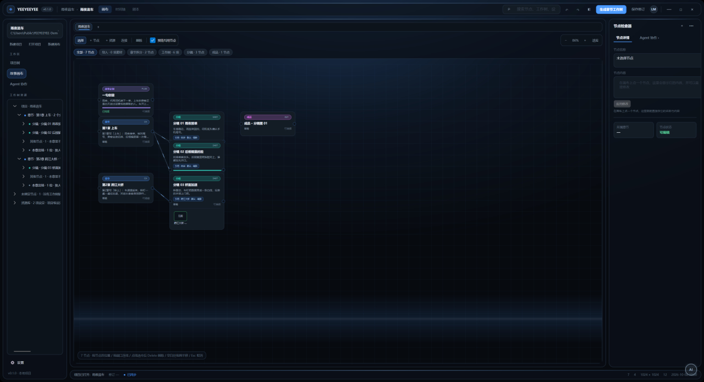
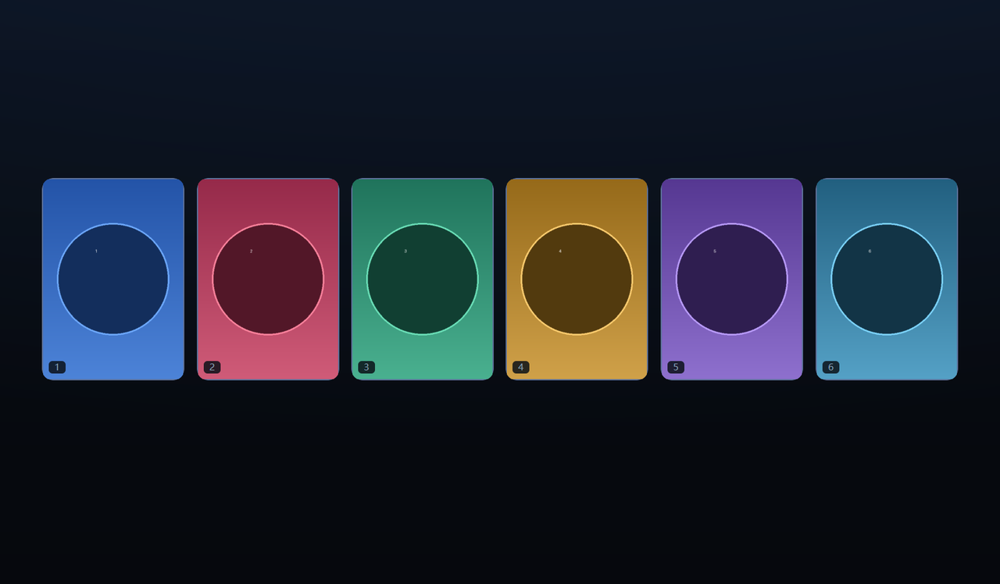
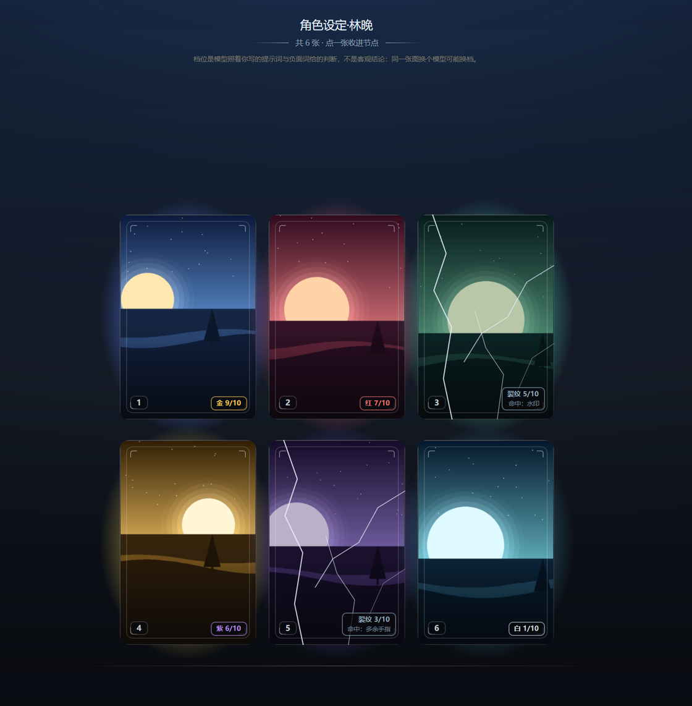
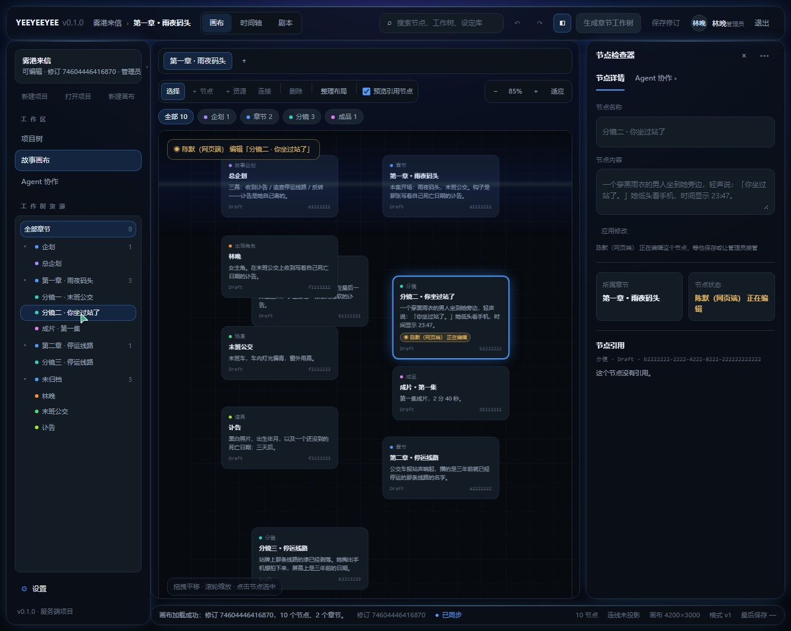
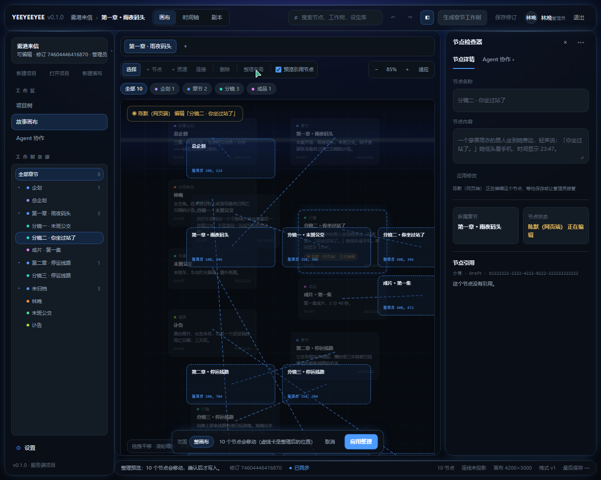
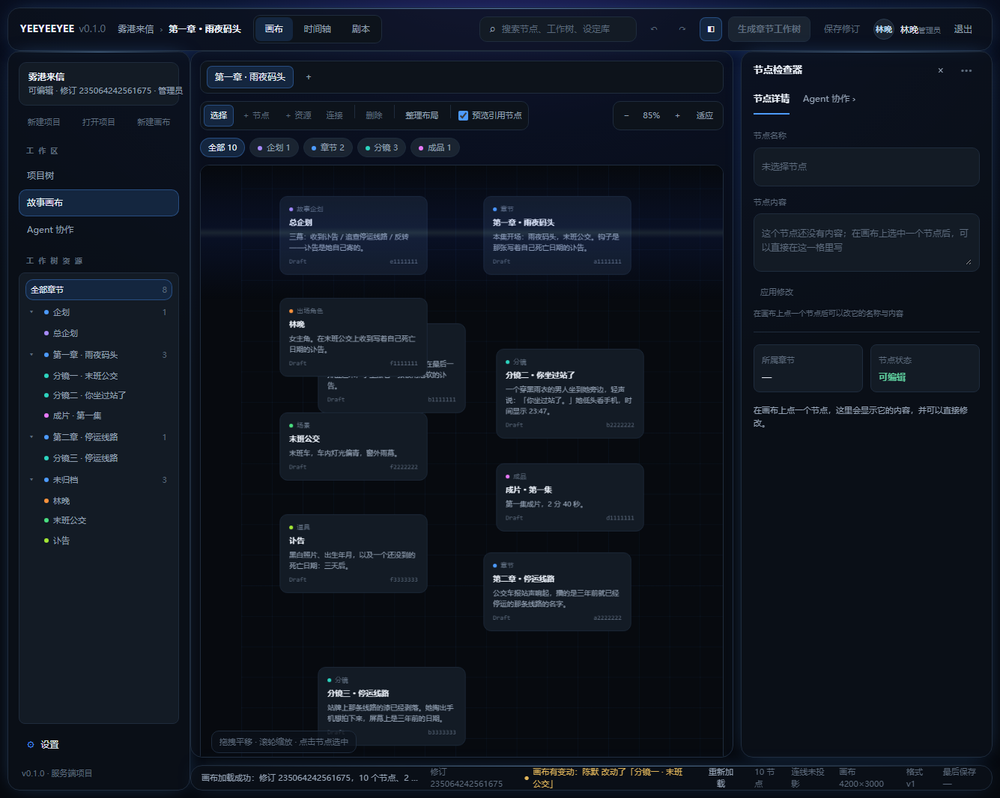

# YEEYEEYEE

> 版本 0.1.1 · 基线 2026-10-04 · YES 工程师 · YES 艺术家

[](https://github.com/Cybeta/YEEYEEYEE/actions/workflows/build.yml)

面向 AI 创作的 Windows 桌面工作区。主线是 **企划 → 章节 → 分镜 → 成品**：先把设定整理成条目，把分镜挂到章节上，出图之后挑一张收进节点，最后串成成品。Agent 可以把一句创意铺成整条链路，也可以只在某一步上手。

角色、道具、场景不占画布节点——分镜通过引用指向它们，需要看时再临时展开。一份设定改了图，所有引用它的分镜会被标出来。项目就是一个文件夹，画布、资产、技能都在里面；密钥按平台加密后存在用户配置目录，不上传任何地方。



## 主要能力

| 能力 | 说明 |
|---|---|
| 画布 | 节点、连线、拖动、缩放平移；章节网格与泳道布局、泳道内局部重排；可切到时间轴与剧本视图，读的是同一份数据 |
| Agent | Ask / AutoStage / ReadOnly 三种授权，13 种 action；准备动作 → 预览暂存 → 统一保存；一批动作整批生效或整批不生效 |
| 出图批次 | 一次出 1–6 张，点下去之前给出预估花费；候选图在节点上方逐格显示进度，挑一张收进节点，其余移入回收站 |
| 出图开奖 | 可选的出图观感：出完不直接摊开缩略图，而是留一排背面朝上的卡，点开走一段全屏揭晓再挑 |
| 出图判档 | 可选的图质量分档：视觉模型照着**你写出去的提示词与负面提示词**给每张打 0–10 分，分数换成档位；踩中负面词的是裂纹卡 |
| 一键出图 / 一键出章节视频 | 节点右键「自检：这条链缺什么…」把「设定图 → 分镜图 → 分镜视频 → 成品视频」四层缺什么、缺几件、该谁来做一次列清，并让你选**一键出分镜图**还是**一键出章节视频**。缺的图可以**一并补齐**（先补图再出视频——每一镜的视频都要一个首帧，缺图直接出视频等于让模型凭空编）；生图池子与视频池子各选一个（选择器按用途过滤，不会让你出图选中视频池子）；每镜时长**从池子的档位里挑，也可以自己填**，填的和清单登记的对不上会提醒但不拦。**动手前**给两笔报价（补图一笔、出视频一笔）与合计，点过「开始」才逐条串行跑，跑完如实报成几条、败几条、败的是谁。清单上取消勾选的项目不会花钱 |
| 出视频 | 分镜节点右键「出这一镜的视频」：走**异步接口**（提交 → 轮询 → 下载），接口形状按**我们这家视频服务**（AnyAIAPI）：`POST /videos/generations` 建任务（字段 `model / prompt / duration / resolution`，图生视频走 multipart 的 `image` 字段）、`GET /videos/{id}` 看 `status`、`GET /videos/{id}/content` 取文件。首帧默认用节点上最新那张图（= 这一镜的画面），没有首帧就走文生视频。一次出一版、按次计费，没有「一批」也没有「挑一张」；超时、任务失败、返回体不认识都如实报，绝不拿空文件冒充视频。**密钥只在同源地址上带**——预设签名的 CDN 绝不附鉴权 |
| 技能与站点池子 | 站点是一级实体（一家站有哪些能用的池子），调用前选池子并记住上次；探测池子全程只读 |
| ComfyUI 工作流 | 贴一个 ComfyUI 地址就能把它库里的**整批网页格式工作流**递归拉下来（并发抓取）、转成服务端要的 API 格式、登记成一个站点；转换规则照官方前端的 `graphToPrompt`，并用四份真机导出的样本**逐字对拍**。出图时按**槽位**把这一镜的提示词与尺寸绑进工作流。视频这一类**暂时不进视频选择器**（详见下文「ComfyUI 工作流接入」） |
| 智能导入 | 给一个接口说明网页，自动建出 api 生图 / 生视频技能与池子，输密钥后跑最小测试并查余额 |
| Web 服务与账号 | 可容器一键部署；浏览器登录后才能进画布（**第一个账号自动成为管理员**），角色分管理员 / 编辑 / 只读，改画布要服务端确认权限 |
| 桌面端接入协作 | 设置第四页「协作」填上服务器地址并登录**同一个账号**：能看到「谁在编辑哪个节点」，**在检查器里开始改一个节点时会占住那条锁**（离开编辑框就还、每 20 秒心跳），于是网页端这时改不了它、并显示「某某（桌面端）正在编辑」。**「保存修订」也交给服务端**：保存前先握手（服务端那张画布的修订号必须等于本地文件的哈希），由服务端做修订 CAS 与锁仲裁、落盘并广播给所有订阅者；别人正占着节点时这次保存会被拒并说清等谁，没联上服务器则退回本地写并如实说明。桌面端**也订阅**这条推送：别人改了画布时，本地干净且没在编辑就**自动重新载入最新版**，否则只提示「你手上这份已经不是最新的」——绝不悄悄吞掉你手上的改动。同一页还有**默认关闭**的「改完自动同步」开关：打开后改动静默约 2 秒自动推给服务端（推的仍是服务端那条路，叫不到服务器也不会被偷偷改成写本地）。密码不落盘，重启要重新登录 |
| 网页端工作台 | 复刻桌面端的三栏工作台：命令条 / 左指挥舱 / 画布区 / 右侧检查器 / 底部状态条。画布按节点真实坐标摆放，可缩放平移、按章节只看一章；时间轴与剧本视图读同一份画布数据。整理布局由服务端按桌面端**同一份引擎**计算，网页端只负责显示与确认。别人改了画布时，手上没有草稿就**自动跟上**，有草稿只提示（与桌面端同一条判据）。工作树上能按类别**新建节点**、检查器里能**删掉节点**、也能**新建与断开连线**——这几件都是**结构级**写入：服务端要整棵树锁、要 `canvas.edit`，别人正占着任何节点时会被拒并说清等谁；新节点的位置由服务端算（同章节最右那个的右边一列），摆好看照旧交给整理布局。连线画在画布上（带方向箭头），工具栏「连接」进连接模式 → 点终点即画线（Esc 取消），或者按住卡片右缘那个圆点拖到另一张卡上；检查器里列出「这个节点连着谁」并可就地断开；「许不许连」（不能连自身、不能重复）两端用的是同一份规则。在画布上按住卡片还能**拖动位置**——这一件与前几件不同，是**记录级**写入（与改标题内容同一档，**不**要整棵树锁：挪一下卡片不该挡住别人的结构改动）。阈值与夹取都照桌面端那一套（\|dx\|+\|dy\| 到 3px 才算拖动，往左 / 往上拖会夹在 0），拖动时卡片与连线一起跟手，松手才写盘；拖过的节点会被标成「**手动摆放**」，整理布局默认绕开它。检查器里还有**节点类别**下拉（同样是记录级，选一下就写）：认不出的类别会被如实拒绝，**改成章节 / 改章节节点的类别都会被拒**——章节挂着工作树与分章关系，那两件事要走桌面端 |
| 应用内更新 | 启动时静默检查最新发行版（**六小时内查过就用缓存**——`/releases/latest` 是未认证接口、每 IP 每小时只有 60 次，反复启动的程序很容易把额度烧光，之后每次启动只剩一句「次数用完了」；已知还在限流窗口里就连问都不问，直接说清等到什么时候。手动点「检查更新」不受缓存挡），可应用内下载升级，退出后由脚本替换程序目录并重启 |

## 出图开奖与判档

开奖按二游抽卡的分拍走，**每一拍的画面都是代码画的**，不用任何素材图：蓄势（徽标呼吸、光点往中心收）→ 爆发（竖光柱撑开、全屏一闪）→ 卡片从中心依次飞出 → 一张张翻面 → 挑一张。



卡片是黑白卡纸加自有的 ◈ 徽记，**颜色全在卡背后那团缓缓流动的光晕里**（取每张图自己的主色相），排列按张数定（六张就是上下各三张），卡片固定 2:3 竖长方形。代价是方图会裁掉两侧约三分之一：六张裁法完全一样，比的是同一把尺子，而收进节点的那张是未裁原图。

许愿那一拍的圆形形象**自带九家的**（`provider-art/` 里是出图接口生成的自创角色，每张的提示词与模型记在 `provider-art/_generation.json`），也可以换成你自己的图，或在设置页点一下用当前图像链路重画。不用任何厂家的 logo 或网上流传的拟人形象——那些是各自的商标与著作权作品，摆上去还会让人以为有官方合作。

开启**判图质量档**之后，每张卡右下角多一枚档位牌（写 `红 9/10` 这种形式），抬头多一行免责声明：



分数带是 **9 分以上红、7–8 金、5–6 紫、3–4 蓝、2 分以下白**，**红最好、金第二**（与多数二游把金放最上面不同）。评审要看的四件事：与出图要求的贴合度、崩坏（多余手指 / 肢体断裂）、穿帮（多出来的东西 / 光影矛盾）、角色与物体互相嵌进去。提示词里还带着负面词原文与这一步在节点树里的位置。三条边界值得先说清：

- **判的是绝对分，不是这一批里的名次。** 名次那套的问题在于：同一批六张都很差时也一定有一张「红」，而那张牌说的是「这批里最好」，不是「真的好」。
- **踩中负面提示词的图是裂纹卡**（卡面裂开、牌上写命中了哪条），分数照给，但它**不参与预兆**。
- **本地只筛客观坏图**（读不出 / 纯色 / 尺寸不对），判不了的如实说「不判」；档位是模型的判断，不是客观结论，界面上明写这一点。

档位同时决定光点数量（红 12 到白 3）、卡背后光晕的亮度与整批入场的强度。**没判过档的批次走统一常数**——「没有档位」与「白档」是两回事，不合并。

**判出裂纹卡会自动重出那几张**（设置 → 生图与生视频 → 出图观感里可关，默认开）：只重出踩中负面词的那几张，好的那些不动；只提示、不需要你操作；同一批最多自动重出 2 次，到顶就如实说「还是裂纹，建议改改提示词或负面词」。重出后只补判那几张（不为没变的图白花一次模型调用）。它**只有判档开着时才可能生效**——判档关着就没有「裂纹卡」这个结论。

**判档要一个能读图的多模态模型**，而当前模型没开「支持图片输入」时**不置灰、也不闷着跳过**：出图那一刻会问你一句——去「设置 → 模型接入」勾上「模型支持图片输入」（或换一个能看图的模型），还是**这次跳过判档、直接把图出完跑通**。跳过的那一批没有档位，状态栏会明说这一点（没判过 ≠ 判成白档，不会让它长得像一批干净的图）。

## ComfyUI 工作流接入

除了「一家站一组池子」，也可以直接接一台 ComfyUI：设置第二页贴地址、点「测试连接」，认出来之后可以把它库里的工作流**整批**拉进来——递归整个 `workflows` 目录、并发抓取、逐个转换，登记成一个站点。

转换是把**网页格式**（编辑器里存的那一份）转成服务端要的 **API 格式**，规则照官方前端的 `graphToPrompt` 来，并用四份真机导出的样本**逐字对拍**。出图时不用你手改工作流：程序先认出这一份里**哪个节点收提示词、哪个收反面词、哪个收尺寸、哪些是种子**，再把这一镜的提示词按次绑进去；认不出的如实说「认不出这一份的槽位」，不猜、不硬塞。设置页那几栏 ComfyUI 字段是**站点文件的投影**——改的是同一个东西，不是两份配置。

转换器修过四个真 bug，写在这里免得再犯：

- **穿过 Reroute 的连线被整条丢掉。** Reroute 在 `/object_info` 里查不到，容易被当成备注跳过——但它的作用是**转发**。不跟过去，下游那个输入就整项消失、服务端判 `required_input_missing`，整份工作流一张图都跑不出来（真实样本里 `VAEDecode.vae` 就是这么没的）。现在会顺着转发节点一路跟到真正的源头。
- **被绕过的节点（`mode=4`）只删节点、不接线。** 旁路和 Reroute 一样是**转发**：官方前端会按类型挑一个顶得上的输入槽、顺着它的连线往上走。只删不接，下游那个输入同样整项消失——**而且这次服务端不报错**：它回 `success`，只是产出为空（实测 370 秒算力、零个文件；丢掉的是必填的 `CreateVideo.images`）。判据与影响面见 `docs/spec-参考图与设定锁定.md`。
- **被转成连线的控件让 `widgets_values` 整体错位。** 控件改成连线输入之后**仍占着它在定义里的位置**；若按「节点 inputs 的顺序」排，提示词会被对到最后一个值上去——实测拿到了 `73` 而不是那段几千字的提示词。
- **动态下拉（`COMFY_DYNAMICCOMBO_V3`）被当成连线槽位。** `SaveVideo` 的必填 `format` 就是这种，丢掉它的后果是二十几个节点全跑完、最后一步抛 `TypeError`，一个文件都不落。

### 长镜头：两条路，代价各不一样

分镜节点右键的「出这一镜的视频」走的是**异步接口**那条链（提交 → 轮询 → 下载），ComfyUI 工作流的提交还没接上，所以视频选择器**整类不列 ComfyUI**——给一个选了必然失败的选项，比暂时不列更坏。

我们另拿 ComfyUI 侧的图生视频工作流实测过 30 秒长镜头，两条路都跑通了，但代价不一样，先记在这里：

| | 单次生成 30 秒 | 分成 6 段 × 5 秒再拼 |
|---|---|---|
| 机位 | **会漂**：实测从两人中近景一路推成俯看桌面 | 守得住（31 秒里始终是两人中近景） |
| 人物形象 | 基本保持 | **会累积漂移**：针织衫漂成西装、风衣漂成衬衫 |
| 音轨 | 自带 | 每段各有，但**在这条 ComfyUI 拼法下会丢掉**（这里只把图像喂给 `ImageBatch`/`CreateVideo`）。注意这跟产品里的「成片」不是一回事：成片走的是本机**无损拼接**，音轨一路保下来（见「还没做的功能」第 3 条） |
| 代价量级 | 一次约 28 分钟 | 6×3 分钟 + 拼接 |

还有一条是模型的、不是我们的：这类工作流的**画面与音轨出自同一个提示词**，没有单独的音轨提示词、也没有语种开关（实测那份工作流的文本入口只有节点 `139` 的 `prompt` 一处）。所以喂中文提示词时，模型产出的语音可能**中英混说**——这条改提示词钉不死，得等工作流或模型给出单独的音轨入口。

短镜头（5 秒量级）没这些问题，前面那些分镜用的都是这一档。

## 快速开始

需要 Windows 与 .NET 10 SDK。在仓库根目录执行：

```powershell
dotnet build YEEYEEYEE.slnx
dotnet run --project YEEYEEYEE.Desktop.Avalonia
```

首次启动停在启动页，选定项目之后才加载画布与设置。项目就是一个文件夹，里面固定有 `project.json` 与 `canvases`、`assets`、`skills`、`plugins` 四个子目录。

进工作台后，在设置的第一页填聊天模型的 Endpoint、Model 与 ApiKey；第二页管出图与出视频，**图像接口有自己独立的地址、模型名与密钥**（一条链路一家站是常态），留空时才沿用聊天那份的密钥。出视频同理有一份自己的地址、模型与密钥，**我们自家那家视频服务填 `https://video.anyaiapi.top/v1`**（模型名取自它的 `GET /models` 里 `kind=video` 的那些），判档则要第一页那个模型勾上「支持图片输入」。密钥按平台加密落盘：Windows 用当前用户作用域的 DPAPI，macOS 用钥匙串，都没有时退到本机密钥文件 + AES-GCM。它绑定账户与设备，换机器或换系统要重新填一次；界面只显示脱敏形式。

可选的 Web 服务有两种跑法。

**Docker 一键部署**（推荐，服务器上不需要装 .NET 或 Node）：

```powershell
docker compose up -d --build
```

浏览器打开 `http://<部署机器的地址>:8080`，**第一次打开会让你建管理员账号**——第一个账号就是管理员，之后由它建别人的账号。数据（账号、任务、资产、场景）都在 `yeeeyee-data` 卷里，容器重建不丢；`docker compose down -v` 清空重来。

暴露到公网之前请在 `.env` 里设 `YEEYEEYEE_SETUP_TOKEN`：不设的话，任何能访问到这个端口的人都能抢先把管理员建走。设了之后首次建号必须带上这个令牌，`docker compose` 会把它作为部署时的一道闸门。默认用「独立场景」模式（卷里一个 `scene.json`），起来是个空画布（网页端能自己新建节点，见下节）；要编辑桌面项目里的真画布，按 `docker-compose.yml` 里的注释把 `PROJECT_DIR` 挂进去并改两个环境变量。

镜像的基础镜像来自 Docker Hub 与 MCR。**若所在网络拉不动 Docker Hub**（`docker pull` 卡住或报连接重置），给 Docker 配一个镜像源即可（写进 `%USERPROFILE%\.docker\daemon.json`，改完重启 Docker Desktop）：

```json
{ "registry-mirrors": ["https://docker.m.daocloud.io", "https://docker.1ms.run"] }
```

镜像约 444 MB。

**本机直接跑**（改代码时用）：

```powershell
npm.cmd --prefix YEEYEEYEE.Canvas install
npm.cmd --prefix YEEYEEYEE.Canvas run build
dotnet run --project YEEYEEYEE.Web
```

浏览器访问 `http://localhost:5000`。Web 端读项目里的画布文件（`ProjectCanvasSceneStore`）并把场景广播给前端；桌面端把「保存修订」交给 `PUT /api/web/canvas`，两端都订阅 `GET /api/web/events`（SSE），所以「桌面改一下、网页跟着变」这条路是通的——触发时机是**保存 / 改动停下**，不是逐帧。

### 账号与权限

登录态放在 HttpOnly 的会话 cookie 里（有效期 14 天，用着会自动续期），库里只存令牌的哈希；口令用 PBKDF2-SHA256 加随机盐，21 万次迭代。三种角色：

| 角色 | 能做什么 |
|---|---|
| 管理员 | 全部：读、改画布、调技能，外加建号 / 改角色 / 停用 / 重置口令 / 删号 |
| 编辑 | 读、改画布、调技能；看不到账号管理 |
| 只读 | 只能读；界面上的保存按钮是灰的，就算绕过界面直接发请求，服务端也会回 403 |

权限在**服务端**按角色换算，前端传什么都不作数。几条刻意的规则：**最后一个管理员不能降级、停用或删除**（否则没人能再管账号）；**改口令会作废该账号的所有会话**（包括当前这条），所以要重新登录；**停用一个账号会立刻踢掉它手里的会话**，不等 cookie 到期；连续 8 次登录失败会锁 5 分钟（按用户名 + 来源地址分别计，不连坐）。

桌面端那条老路径（Bearer 令牌 + 必须来自本机）保留不变，它和会话是「或」的关系：桌面桥推场景用它，浏览器用会话。容器部署下桌面端连不进容器的 loopback，所以那条路在容器里就是关着的。

### 编辑锁（谁在编辑）

多人改同一张画布时靠**编辑锁**避免互相覆盖。按操作类型分两档：改标题、正文、引用这类只动一个节点自己字段的，用**节点级锁**，别人改别的节点不受影响；新建、删除、移动节点这类会改变树结构的，用**整棵树锁**，短暂独占。

锁由服务端裁决，记录写在画布旁边的 `<画布>.edits.json`（会话状态，**不写进画布文件**，所以锁来锁去不会动到数据一个字节）。持有方每 20 秒续期一次，两分钟没续期就自动失效——断电、关窗口都不会把节点永久锁死。冲突时明确告诉你**等谁**：

> 林晚（桌面端）正在编辑，请等他保存或让管理员接管

只读账号**能看锁但不能占锁**（否则只读也能把人挡在外面）。强制接管是管理员专属，而且要显式带 `force`，不存在「悄悄踢掉别人」的默认行为；接管时会如实说出顶掉了谁。

现在的状态是**两端都遵守这套锁**：网页端能看见别人的锁并把节点变成只读，也会在**真的打算改**时去占锁；桌面端（第 182 轮起）同样——登录接进服务器之后，检查器的可编辑性、节点编辑入口与出图这三处都会先问一句「这个节点有没有别人占着」，占着就只读，并说出是谁在编辑，而不是照改不误、等保存时才报一句。两边的关系是「以锁文件为记录，服务端进程做仲裁者」。

界线上有一处要说清：桌面端被挡的是**节点**。结构性操作（新建 / 删除连线、整画布保存）不做逐节点判断——它们由服务端在保存时用**整树锁**与**修订 CAS** 拦（`EDIT_CONFLICT` / `SCENE_REVISION_CONFLICT`），因为那些操作本来就要经一次整画布写入才能落地。

### 网页端工作台

网页端**不是**桌面端的一个简化版，而是同一套工作台的第二次实现：布局骨架、配色、控件形态都对着桌面端来，用户不需要学两套操作。三栏的宽度（244 / 弹性 / 336）、命令条与状态条的高度、九个节点种类各自的颜色，与桌面端逐项对齐。

**真实数据，不留占位**。画布按节点在文件里的 `X` / `Y` 摆，不是列表；时间轴按章节分组、剧本按工作树显式顺序摊开；左栏那棵树是「章节 → 节点」；检查器里的章节来自节点的稳定 `chapterId`，可写性来自服务端的 `readOnly` 与当前角色。面包屑显示的是**项目名与画布名**（来自 `project.json` 与画布文件的 `Title`），不是文件名；这里刻意**不显示项目路径**——那会把服务端的目录结构泄露给浏览器，换成对这个用户真正有用的「修订号 + 可写性」。

还在**可见但不可点**的状态的东西都给了原因（工具栏的 ＋资源、撤销重做、生成章节工作树）：占位成可点、点了没反应，比灰着更让人困惑。卡与卡之间的**连线画出来了**（箭头指出方向），状态条上的连线数报的是服务端投影过来的真数。

**节点上点右键有菜单**，内容与桌面端同一份来源：服务端拿共享的 `NodeAssistPlanner` 算出一份「协助计划」（按节点类型给「出图 / 只给提示词 / 交给 Agent」），网页端只补上「这一端有没有那个执行方」。出图类把提示词填进 Agent 面板并切过去（**不自动生成**——出图前先看到会发出去的话），提示词类复制到剪贴板，Agent / 视频类灰着并写明原因（网页端还没有那两个执行方）。另两条是「编辑节点…」（切回检查器）与「删除节点」。**灰着的项一律带原因**，有测试钉住。

画布上的**引用徽标带着缩略图**：客户端只说「哪条设定的哪个变体哪一版」，由服务端解析并**只服务项目内的文件**（共享素材目录 `ASSET_DIR` 与项目目录，其余一律拒绝）；取哪一张图由共享的 `EntityAssets.PreviewImage` 决定，与节点投影里的 `thumbnailRef` 是同一个方法。**取不到图就把图收起来**——缩略图是加成，缺了它那条引用仍然是一枚可读的徽标。检查器里还有一格**「挂上设定」**：从项目库（每个实体 × 每个变体）挑一条挂到当前节点上，**选一下就写**（与「节点类别」同一条规矩，不进草稿）。节点出过的图也在检查器里（那一格「产物附件」，最近在前）——服务端只投影**元数据**（没有路径），图片按 ID 取字节；非图片如实列出来，暂时不给播放器。

右侧栏第三个页签是**设置**（只读）：模型接入 / 生图与生视频 / 协作与技能三组，回答「现在配了什么、密钥配没配」。**密钥不会出现在网页端**——它在盘上是加密的，而这个服务端跑在 Linux 上解不开（就算解得开也不该解，那属于桌面端那台机器）。所以改设置只能到桌面端，这是这条链的边界。

页面上的配色**与几何、圆角都不手写在 `tokens.css` 里**：唯一的一份是 `YEEYEEYEE.Canvas/src/shared/designTokens.json`，`tokens.css` 里那两块与桌面端 `App.axaml` 的纯色块都是它生成出来的（`npm run tokens`）——**桌面端改颜色/圆角只改那一份**，两端不会再各走各的。`tokens.css` 里手写的是字体，以及那几个渐变/投影；桌面端的几何与圆角散在 `MainWindow.axaml` 的元素属性与 `App.axaml` 的各个 `Style` 里，不是一个独立块，那一侧靠测试对数（`tests/designTokens.test.ts`）。

画布的视角操作与桌面端对齐到同一条曲线：滚轮一格 `exp(0.12)`（约 1.1275 倍）、缩放夹在 25%–220%、「适应」不放大、网格 48px、节点卡 232×104、点空白处先取消选中再进入平移。**双击不做适应**——桌面端的双击（落在节点上）是进引用画布，给它加一个桌面端没有的手势，等于让同一个动作在两端有两种含义。唯一有意的差异是：桌面端打开画布不自动适应（停在上次的位置），网页端打开页面就等于打开画布、没有那个动作可挂，所以加载后自动适应一次，此后只有点「适应」才动视角。

**整理布局在服务端算，用的就是桌面端那一份引擎**。网页端不往上传坐标，只来说「整理整张画布」还是「只整理这一章」：`POST /api/web/layout/plan` 只算不写，回泳道划分与逐节点改动；`POST /api/web/layout/apply` 按同一份引擎**重算一遍**再落盘（客户端送来的坐标不可信，而「同一份画布 + 同一份引擎」的结果是确定的）。引擎是 `Desktop.Shared` 里的 `CanvasSwimlaneLayout`，两边都是 `net10.0` 且它不含 UI 框架依赖，所以 Web 服务直接引用同一份代码——在 TypeScript 里另写一份，两份对同一张画布迟早会排出不同的样子。

两条规矩值得单说。一是 **apply 不会因为一次注定失败的请求占住锁**：先干跑（修订是否陈旧、布局是否被阻断、是否要确认覆盖手动摆放），确认真的要写才去拿整棵树锁；别人正拿着就如实回冲突与持有者。二是 **`plan` 给出的坐标与 `apply` 落盘的结果必须逐项相同**，这条有回归钉着——它是「服务端重算」这种设计的等价性证据。位置本来就排好时返回「无需改动」，既不动字节也不推进修订。

界面上，预览出来的虚影画在**目标位置**（虚线卡），再拉一条虚线从原位置指过去；会被移动的节点压暗，虚影整层不可点（桌面端的预览层同样不参与命中测试）。应用前可以切换范围——整画布，或「只整理某一章」；有手动摆放的节点会被移动时要显式勾一次「连手动摆放的一起动」。**桌面端界面里也有手动整理的入口**（第 165 轮补上，`CanvasLayoutSession`：预览 → 确认 → 应用，只改内存里的坐标，「保存修订」时才落盘）。

**编辑锁也画到画布上了，而且网页端自己也会占锁**：节点卡挂着「陈默（桌面端）正在编辑」，画布左上角列出「谁在编辑什么」，检查器里选中被锁的节点会变成只读并写明等谁——冲突文案与服务端那句是同一句。

占锁的时机是有讲究的：**只有真的打算改才占**——焦点进了编辑框，或者草稿还没保存。光选中一个节点不算，否则点着看一圈就撒一地锁，等于把别人挡在外面而自己什么也没改。不需要了就**立刻还**（不等它超时：超时是给「浏览器崩了」兜底的，正常路径上让人多等两分钟只会让人以为系统坏了），拿着锁的时候画布上那枚徽标换成主色并写「你在编辑」，与自己无关的锁是黄色。

**变更不靠猜**：写成功之后服务端会往 `GET /api/web/events`（SSE）推一条「画布变了」，订阅方据此刷新。推送的语义是「**告诉你变了**」而不是投递数据——载荷里只有修订号、记录号与是谁，真内容仍旧 GET 取。这样丢一条的后果只是晚一拍，而不是状态错；通道也因此可以是有界的（满了丢最旧的），不必为了不丢而让慢客户端拖住服务端内存。

判定「这次到底写没写」拿的是**成功提交的次数**，不是修订号：项目模式的修订号是画布内容的哈希，新哈希不保证比旧的大，拿它比大小等于掷硬币。而载荷里带出去的修订号，必须是接口回报给客户端的那个数（客户端就是拿它和自己手上的比谁更新的，两边不是同一把尺子的话这条推送等于没发）——这一处曾经写错，是回归把它钉住的。写入失败与「位置本来就排好」这类 200 都**不广播**：让所有人白刷一次的后果是，久了就没人信这条推送了。

编辑锁同理：`edits.changed` 一到就立刻重取锁列表，别人的锁基本是即时出现、即时消失。**但 15 秒的轮询仍然留着**——推送是加速不是替代：少收到一条消息最多是晚 15 秒看到，而不是看到错的锁，后者会让人放心地去改别人正在改的东西。推送断了会如实写出来（是降级，不是故障），画布照旧可用。

客户端这边**也不比大小**：修订号是内容哈希，新内容的哈希不保证比旧的大，拿 `>` 判断的话真实协作里大约一半的推送会被静默丢掉。这不是推测——浏览器里实测撞到过一次（服务端报 235064242561675，客户端手上是 280703274272840，那条推送就这么没了，而且不报错）。所以判据是「和我手上的**不是同一个**」，界面也就只说「画布有变动」而不说「有新版」：哈希本来排不出谁更新，装成知道反而是撒谎。

为什么是 SSE 而不是复用当时那条 WebSocket（`/ws/canvas`，第 180 轮已随旧的 HostBridge 兼容面一起删掉）：那条是**双向**广播口、走 `host/...` 协议，跟「画布 / 编辑锁变了」不是一回事，混进去只会让两种协议纠缠在一起。浏览器这边要的是单向、带会话身份、能自动重连——正好是 `text/event-stream` 的形状。



上图的画布上，分镜二挂着「陈默（网页端）正在编辑」的徽标，检查器里那一节也变成只读并写明等谁；左栏是工作树，右栏是节点检查器，底下是状态条。点工具栏的「整理布局」，会先把结果画成虚影再问你要不要写：



别人改了画布时，状态条上会浮出琥珀色的一条「画布有变动：陈默 改动了「分镜一 · 末班公交」」，右边给一个「重新加载」——点它就把修订追平，标记随之消失：



### 两条主线

**叙事轴是工作树**：项目 → 章节 → 角色 → 能力，写的是剧情向设定，回答「这一章发生什么」；画布节点靠 `WorkTreeItemId` 挂到章节点上。**视觉轴是设定库**：实体 → 变体 → 不可变版本，回答「长什么样」；分镜不自己复制描述，而是引用某个实体的某个变体，出图时把引用的描述拼进提示词并带上参考图。

节点的位置由 `ParentNodeId` 决定，叙事归属由 `WorkTreeItemId` 决定，视觉来源由引用决定。三者各管一件事，混用会让自动排版或引用判断出错。字段存在也不等于同步已实现。

**章节归属一律按稳定 ID 解析，绝不按章节名猜**：`CanvasChapters.ResolveChapterId` 先看 `WorkTreeItemId` 锚点、再沿节点父链上溯，章节名只是显示文本。桌面端的时间轴与剧本两屏、画布泳道、以及网页端的章节筛选与整理预览，现在共用这一条规则——早先桌面端那两屏是按章节名文本绑的（同名章节被并到一起、改个显示名就整批换章，剧本还按名字排序，于是「第十章」排在「第二章」前面）。只有章节名、没有锚点的节点会如实显示成「未分章」，诊断里报 `CHAPTER_TEXT_WITHOUT_ANCHOR`：**猜错了比承认没归章更坏**。

### Agent 的三种授权

**Ask**（默认）把每批动作先做成虚影放在画布上，你看过再决定；**AutoStage** 直接落进预览层，仍要你点保存才写盘；**ReadOnly** 只回答，不改画布。虚影只改预览层，所以「问一句」和「改数据」是分开的两步。提交后想退回，用面板上的撤销上次提交——它基于快照回滚，因此要求那之后画布没有别的改动。面板收起后右下角留一枚圆形徽标，平时半透明（实心会挡住底下的节点），鼠标移上来才变实。

## 仓库结构

| 目录 | 职责 |
|---|---|
| `YEEYEEYEE.Core` | 作业、协议、引用图、访问策略等核心契约 |
| `YEEYEEYEE.Host` | 单机执行服务、ComfyUI 提供方、SQLite 任务库 |
| `YEEYEEYEE.Desktop.Core` | 画布模型、存储、迁移、项目库等基础设施 |
| `YEEYEEYEE.Desktop.Shared` | 无界面逻辑：Agent、画布计算、AI 提供方、技能与档位判定 |
| `YEEYEEYEE.Desktop.Avalonia` | 桌面主端（Avalonia）。工作台的布局与配色以它为准，网页端对着它对齐 |
| `YEEYEEYEE.Web` | Web 服务：镜像、账号、创作与编辑锁接口（`/api/web`） |
| `YEEYEEYEE.Canvas` | React/Vite 前端：网页端工作台在 `src/shell/`。产物单独构建，不在解决方案里 |
| `YEEYEEYEE.Mcp` | 独立只读 MCP 服务，不在解决方案里 |
| `provider-art/` | 各厂家的形象图，构建时拷到程序目录旁 |
| `tools/` | 发布脚本 |

### 依赖是单向的（解耦现状）

依赖是单向的：`Core` → `Host` → `Desktop.Core` → `Desktop.Shared` → `Desktop.Avalonia`，没有任何项目反向引用界面端。两份共享代码（`Desktop.Core` 与 `Desktop.Shared`）是唯一来源，界面只调用它们。逐项核对过一遍：引用图无环、无反向边、共享层不含 UI 框架依赖。

**界面端有两个**：桌面 Avalonia 与网页 React。两者不共享代码，靠同一份契约对齐——网页端只认 `YEEYEEYEE.Web` 的 `/api/web`，而 `/api/web` 读的就是桌面项目的画布文件，这是「桌面端是权威数据源」的直接后果。

不过**计算是可以共享的**：`Desktop.Shared` 与 `Desktop.Core` 都是 `net10.0` 且不含任何 UI 框架依赖，所以 Web 服务直接引用了它们（`YEEYEEYEE.Web.csproj` 里那一行）——泳道布局这类纯计算因此两端是同一份代码，不必在 TypeScript 里再写一份。代价是这条链上不能碰 Windows-only 的 API（`Desktop.Shared` 里带着 DPAPI 那套加解密，在 Linux 上编译得过、调用会抛），以及容器镜像的 `Dockerfile` 要同步加上这个项目。

`YEEYEEYEE.Mcp` 是**完全自包含**的（零项目引用）。前端 `YEEYEEYEE.Canvas` 只与 `Desktop.Shared` 有一处**文件级**耦合：`src/shared/uiText.json` 被 `Desktop.Shared` 以 `EmbeddedResource` 嵌进去（`UiText`），一条测试读 csproj 对账。

## 构建与验证

2026-10-04 基线：解决方案构建 **0 错误**；Agent **242** 项、Core 29 项、Migration `8/8`、G6V1 `checks=40`、前端 TS 138 项（15 个文件）、Web 回归十二段全部通过。构建期另有 **18 条 CS 警告**（可空性 11 / 换行前 Avalonia 过时 API 5 / 成员隐藏 1 / null 字面量 1），与依赖无关；传递依赖的 `NU1903` 见「工程债」#6，它以干净还原（CI）时的计数为准——**本机 restore 复现不出来**，所以本机看到的警告数会少于 CI。

2026-10-03 基线：解决方案构建 0 错误（12 条 `NU1903` 警告，全部来自传递依赖，见「工程债」）；Agent 215 项、Core 29 项、Migration `8/8`、G6V1 `checks=40`、前端 TS 138 项（15 个文件）、Web 回归**十二段**（HTTP / 认证 / 编辑锁 / 整理布局 / 变更推送 / 桌面客户端 / 桌面画布写入 / 桌面订阅 / 结构 / 连线 / 节点位置 / 节点类别）全部通过；容器镜像在 GitHub 的干净机器上构建通过。

提交与 PR 会触发 [CI](.github/workflows/build.yml)，三个互相独立的 job——哪个红了就能直接看出是哪一层出的问题：

| job | 跑什么 | 为什么用这台机器 |
|---|---|---|
| `dotnet` | 构建解决方案，再逐个跑五个测试项目 | 必须是 Windows：桌面端与其中四个测试项目的目标框架是 `net10.0-windows` |
| `canvas` | `npm ci`、单元测试、类型检查与打包 | Node 22，与 `Dockerfile` 里的 `node:22-alpine` 对齐，免得本机过、镜像里不过 |
| `image` | `docker build` | 只验证镜像能不能构建出来；运行期行为靠 Web 回归与本机冒烟覆盖 |

同样的命令在本机这样跑：

```powershell
dotnet build YEEYEEYEE.slnx
dotnet run --project YEEYEEYEE.Agent.Tests
dotnet run --project YEEYEEYEE.Core.Tests
dotnet run --project YEEYEEYEE.Migration.Tests
dotnet run --project YEEYEEYEE.G6V1.Tests
dotnet run --project YEEYEEYEE.Web.Tests
npm.cmd --prefix YEEYEEYEE.Canvas test
npm.cmd --prefix YEEYEEYEE.Canvas run build
docker compose up -d --build   # 起容器，浏览器开 http://localhost:8080
```

`YEEYEEYEE.slnx` 含**全部 12 个项目**（7 个生产 + 5 个测试），所以第一行那步构建就是「连测试项目一起编得过吗」。**只负责编**——这五个测试工程是控制台 runner（不是 `dotnet test` 那套），跑还得各自 `dotnet run`。
那条守卫在用例里：仓库里任何一个 `*.csproj` 只要没出现在 `YEEYEEYEE.slnx` 里，`SolutionCoversEveryProject` 就会红。第 132 轮的教训是「构建通过」被读成了「什么都没坏」，而当时测试项目与 `YEEYEEYEE.Mcp` 都漏在解决方案外面。

发版用 `tools/publish-release.ps1`：按项目文件里的版本号打出一个便携 zip，默认框架依赖（约 12 MB，目标机器需要 .NET 10 运行时），加 `-SelfContained` 则把运行时一起打进去。把 zip 上传到对应的 GitHub 发行版，应用内升级下载的就是它。

## 路线图

> 本节只写「还没做」与「已知限制」，能用的部分见上文。分四类：**还没做的功能**（带验收方向）、**实现缺口**（代码在但没走完）、**工程债**（不影响功能但迟早要还）、**边界**（不打算做，写在这里免得反复讨论）。

### 还没做的功能

#### 1. Web 创作

账号系统与容器部署已经可用。工作台的**第一层（外壳 + 画布）已复刻完**：三栏骨架与各区内部布局、配色与控件形态、画布（按节点真实坐标摆放，可缩放平移）、时间轴、剧本、章节树、检查器写路径、Agent 任务面板都在 React 里跑起来了。剩下的按优先级：

- **整理布局两端都通了**，用的是同一份 `CanvasSwimlaneLayout`：网页端由服务端算（`plan` 只算不写 → `apply` 要整棵树锁，界面给虚影预览 → 应用 / 取消 → 需要时确认覆盖手动摆放）；桌面端第 165 轮补上了工具栏里那个手动入口。两端对齐的三条规矩：**阻断冲突整批拒绝**、**手动摆放的节点默认不动**、一起动得显式点头。要分清的是：算一次的整体排布走引擎，拖动过程中的实时跟随留在前端算。
- **交互口径抽成两端共读的共享定义**：唯一的一份是 `YEEYEEYEE.Canvas/src/shared/uiText.json`，网页端直接 import，桌面端用 `EmbeddedResource` 嵌同一个文件（`UiText`），一条测试读 csproj 对账。已迁：画布手势提示那一行、「谁在编辑」那句话与来源端说法、桌面端连线手势那 6 句、面板与视图切换的标签、检查器那句「改完点「应用修改」或按 Ctrl+Enter 写回画布」、节点右键菜单的两个标签。另有一条测试**扫全部 C# 源码**，把代码里引用到的每个键与共享文件对一遍。待迁：其余状态机文案。配色那条另用了一套生成器（见「工程债」#7）。
- **未接的**：网页端设置页的**写入**、桌面端右键里的「查看上游设定…」「运行技能：选一个池子…」「自检：这条链缺什么…」（它们要有站点池子与自检能力，网页端没有）。
- **桌面端 → Web 的实时同步：三半都做了，但都是「按保存/改动停下才推」，不是逐帧。** 没做的：桌面端在「手上有未保存改动 / 正开着编辑框 / 正在保存」时收到远端改动只会提示，需要人自己决定（这是刻意的：自动重载会吞掉手上的东西）。

#### 2. 多端协同

服务端的**编辑锁已经能用**，桌面端与网页端两头都做完了（能看锁、会占锁、会遵守）。**还缺**：在线状态、撤销语义、项目级权限。

#### 3. 设定图锁定与参考图

[规格见 `docs/spec-参考图与设定锁定.md`](docs/spec-参考图与设定锁定.md)。

要解决的是「第一集是剑、第二集变刀」这类漂移：角色 / 道具 / 场景会跨镜复现，只要靠模型现编就会越拍越不像。四层链（`GenerationStage`）与「引用过期」都已经在，缺的是把设定图**真的当参考图喂进分镜图**、以及参考图的**张数与寻址**规则（今天上限默认 1，且下标是按图片拍平算的，角色带三视图会把道具的下标推后）。规格里写了三条规则、五步落地与逐步验收。

「引用过期」也进了**自检报告**（`GenerationAuditReport.Stale`）：改了一个角色的外观之后，原先只有画布卡片上有那行提示，而那要你正好看着那个节点才会看到；现在自检这个「下一步该干什么」的窗口里会多出一张「产物过期」卡片，点名哪个节点照着的哪条设定变了，并给一个「定位」。两条口径是刻意的：**过期不是缺**（不进「缺 N」的计数、也不进一键的预勾清单——重出是另一件事、另一笔钱，要重出哪几件由用户自己定），**判断不了的要说清**（老产物没记过依据时判不出过期与否，报告里会写明有几个节点属于这种，免得「0 处过期」被读成「没问题」）。摘要、文本版与花费那一句也跟着带上这笔账。

**五步都做完了**，并且已经在真机上跑通一次：三张设定卡（角色 / 道具 / 场景）走一份四槽的多参考工作流，从服务端存下来的 prompt 回读，三个槽逐字收对，出的片子看得到人物与道具跨帧一致。出图对话框里还有一块「参考图（这一镜会喂哪几张）」：候选按默认顺序列出来、默认全勾，取消勾选就只喂勾上的那几张，下面那行**在点下去之前**就写清「带哪几张 / 丢哪几张 / 卡在谁身上」。第 5 步（视频那条路）的结论是「接口只收一张」——所以那条路改成如实说明：首帧照旧，带不上的设定图写在状态栏最前面，而不是假装带上了（能带几张由链路自己声明，将来哪家接口支持多图，只改那一处）。

「这一镜到底能喂几张」是**三处取小**：用户设置、池子清单里声明的张数、这份工作流的底图槽位数（合集型取**最大那一组**，不是把各组加起来）——而且说得出**卡在哪一处**，免得明明是「这家只吃 1 张」，却把用户指去改设置。两处细节是刻意的：设置填 `0` 是「不带参考图」（真实约束），池子没写张数只是「不知道」，不该反过来把上限压成 0；工作流没有底图入口就按 0 算，塞进去只会白跑一次。

ComfyUI 那边的绑值分两种情况：入口同属一组时按「角色 → 道具 → 场景」平铺；而**合集型**（一个文件里并排放着「单图 / 双图 / 三图」几条各自带输出的管线，站上有 6 份）要**按组填**，每组各取前几张。平铺的后果是图全落进前两个小组，真正能收三张的那组一张都拿不到——服务端不报错，只是出的不是你给的东西。

#### 4. 接剪映（草稿格式）—— **待办**，先不做

想法是把「成片」这一步交给剪映：我们生成一份**剪映草稿工程**（每条分镜、每条音轨、时间轴都摆好），用户在剪映里精修再导出。社区已有现成的东西可以借：`pyJianYingDraft` 直接生成草稿文件、`VectCutAPI` 带一个 MCP 服务端、`capcut-cli` 能列草稿看时间轴。

**为什么先不做**（下面是查过的实情，不是顾虑）：

- **它产出的不是 mp4，是一份草稿。** 最后一步仍要剪映打开再导出；而 `pyJianYingDraft` 自己写着「剪映 7+ 疑似隐藏了窗口控件，可能导致**批量导出功能失效**」。所以它给的是「一键生成草稿」，不是「一键拿到成片」。
- **格式是逆向来的、还会变。** 剪映 6+ 对 `draft_content.json` 做了加密，社区项目的模板模式因此受限。把最后一公里押在别人版本的加密格式上，是**持续的维护风险**。
- **我们这边没有 MCP 客户端。** 仓库里只有一个我们自己写的 MCP **服务端**（`YEEYEEYEE.Mcp`，只读、stdio JSON-RPC），下面的「边界」里也写着它不接入桌面端。真要接，得先加一层客户端（配置、拉子进程、工具发现、超时与权限）。
- **那些 MCP 背后是 Python**，于是又回到「要不要随包带一个运行时」。
- 本机现在**没装剪映**（安装目录、草稿目录、进程都没有），要验就得先装。

还有一句得说破：**MCP 在这件事上是绕远路**。MCP 是给**模型**调工具用的协议；我们要生成草稿，直接调那个库或 CLI 更短。只有「让 Agent 自己剪片」这个目标才真的需要 MCP，那已经是另一个能力了。

**真要接之前，先验一件事**：用 `pyJianYingDraft` 生成一份草稿，确认**当前版本的剪映能正常打开**。能打开，这条路才算存在。

### 实现缺口（代码在，但没走完）

1. **项目级资源库迁移**：多画布共享同一份实体这个目标没走完，`Entities` 仍随每张画布各存一份。稳定 ID、引用扫描、删除保护、回收站与版本锁定都已就位。
   复核时发现的最大问题是**两处已有代码却没人调用**（看起来在工作、其实没在工作），已接线：
   · **打开时按库对齐**（`ProjectEntityScope.MergeInto`）：从画布库打开、进项目还原标签时各跑一次。此前画布 A 打开时看不到画布 B 对同一批共享资源的改动，要等 A 自己被保存才由 `RefreshSnapshots` 追平，那期间摆的是陈旧快照；现在同时把「库里找不到的权威资源」标成缺失（G6-R3），缺失之后解析 / 预检 / 出图按阻断处理。只在**打开**这条路上跑，不每次切标签都跑——切标签时手上的改动已经通过 `TryPublish` 落在库上，再拿库覆盖一遍会让正在编辑的东西忽然变样。
   · **开跑前现场核验**（`RefreshAuthority`）：自检窗口打开前与一键开跑前各核一次（库可能在窗口开着的时候被删掉或漏拷，那时旧标记还写着「正常」）。它**只更新标记、不碰内容**，所以不会抹掉未保存的编辑——这条契约单独有用例钉着。
   **仍然放行的部分，限定词收紧到它真正成立的范围：单机、单画布、不跨画布共享编辑**。同一项目多张画布共享实体时还有三处缺口，各有代价、都要先定方案：迁移工具在应用内**没有入口**（`ProjectEntityMigration` 只有测试在调，旧项目里「每画布各存一份」的实体在应用内迁不动）；项目库文件**没有期望哈希 / CAS**（两份画布先后改同一实体 = 后写覆盖，没有冲突检测）；项目库级的删除保护（`ProjectEntityDeletion`）也只有测试在调，实体删除目前只走 Agent 那条已受保护的路径。
2. **稳定 ID 全链路与旧数据迁移 —— 已复核，修掉三处残留**。结论：主干（章节、引用、工作树、连线、父子）确实都走稳定 ID，但有三处仍在按名称或顺序绑，已改：
   · **成片的镜头清单**改记**分镜节点 ID**（`WorkflowAttachment.ShotRefs`，与给人看的 `ShotList` 并存）：「这一版比上一版多了哪一镜」只能按 ID 比——按标题比的话，在画布上改一个分镜标题就会被读成「少了一镜、多了一镜」。老版本（这之前拼的）退回按标题比，并如实说明这条限制。
   · **查不到的变体 ID 不再悄悄换成第一个变体**（`WorkflowCanvasState.ResolveReference`）：带了一个查不到的 ID 说明这条引用已经对不上，报「引用失效」远好过照另一个设定画出来还不吭声；老引用（不带变体 ID）仍按约定落到第一个变体，那是有意的兼容。
   · **章节改名 / 合并只跟随自己这一章**的节点文本（`CanvasChapterOperations`）：原先只按「文本等于旧名」选，两个同名章节里改一个会把另一个的节点文本一起改掉；没有锚点的老节点（只有文本字段）仍按文本跟随，否则它们的显示文本从此不再更新。
   仍按名称 / 顺序绑、**这次没动**的三处（都要先定方案，不是顺手能改的）：技能路径的 `ref:N` 仍按「所有引用的图片拍平」的下标寻址（规格里已判定该改成按槽位寻址，见 `docs/spec-参考图与设定锁定.md`）；Agent 动作解析仍以**名称**为首选键（有「唯一命中才认 + ID 短前缀兜底」的安全阀，同名歧义会拒绝，但改名会改变动作落点）；ComfyUI 转换按 `widgets_values` 的位置游标绑值、参考图按位置灌槽位（工作流内部顺序，不是实体 ID）。
3. **成片（把每一镜串成一段视频）**：**已做**。单镜的视频照旧是异步任务（提交 → 轮询 → 下载），串片这一步现在按「**无损拼接**」实现：按分镜顺序把已经出好的每一镜接成一段，画面与音频的样本字节原样搬运、**不重新编码**，也不需要 ffmpeg 之类的外部程序（见下）。
   两条边界要记住：**它不生成画面**——缺哪一镜就如实说缺哪一镜，不会拿一段凭空生成的镜头冒充成片；**顺序不自己发明**——用的是泳道布局那条规则（工作树显式顺序 → 阅读顺序），所以画布上第 2 镜的那一段，拼进成片里仍在第 2 位。
   拼接只认实测到的那一种容器形状（`ftyp+moov+mdat`、单 `mdat`、无 `moof`、32 位 `stco`、编辑列表最多一条），其余一律如实拒绝而不是猜着拼——**接错的容器比接不了更坏：能播，但音画会慢慢跑偏**。
   接缝对齐是这里最容易做错的地方，完整推导写在 `Mp4Concatenator` 的类注释与 `PrimingSamplesToDrop` 里：实测每一段的两条轨道都带 `elst.media_time=1024`，但视频那条的 `ctts` 首条正好也是 1024（**合成偏移，一帧都不能丢**），音频那条 1024@32k 正好是一帧 AAC（**编码器预听样本，要丢一帧**）。按这条算视频与音频每段都是 5.16667s；不剪的话音轨每段多 32ms，六段下来音频迟到 160ms。
   **判读**（6 段真 mp4 拼成 31.000s / 3.3MB）：视频包 SHA256 `744/744` 全等、整段重编码 0 行报错、解码帧数 `744` 与声明一致；音频包 SHA256 `972/972` 全等（按每段丢一个预听样本的口径）。这里必须用**独立解码器**判读，不能用我们自己的解析器——因为产品与用例的造样本工具曾同时漏读 `stco` 的 `version/flags`（少了 4 字节，第一个 chunk 的偏移被当成 `entry_count`），两边错得一样，254 项用例全绿、真机上却从第一帧起就是垃圾字节（解码器只报 `Invalid NAL unit size`）；是这条路把它揪出来的。另有一处同源的错：编辑列表 `elst.media_time` 被一律写成 0，会让视频整条时间轴晚 83ms（帧数从 744 掉到 743），现已按轨道分别处理。
   两条判读限制如实记着：本机自带的 ffmpeg 是**精简构建**（只有 `mov`/`mp4` 复用器、没有任何音频解码器），所以**音频只验到包级字节全等，解码没验**（未改动的源段同样报 `Unknown encoder 'aac'`，可排除是拼接引入的）；音频的听感与接缝是否真的同步，仍需人耳过一遍。
   **版本对比（「章节 → 成品」）**：**已做**。每拼一次都会在成品节点上多留一段（不覆盖旧的），所以一个成品天然有「这一版比上一版差在哪」的问题。现在时间轴上每一章会把这个成品拼过的每一版摊开，点上「成片」按钮之前也会先把已有的版本摆出来。每版的事实全部来自**容器头**（`Mp4Concatenator.Probe`：时长 / 轨数 / 分辨率 / 帧数 / 体积，不解码、不靠文件名），差别只报量得出来的那几项，不替用户下「哪一版更好」的结论。
    **每一版都能直接看**：版本旁边有「播放这一版 / 打开所在文件夹」（交给系统播放器，不自己实现一套播放器）。画布上节点产物的缩略图点一下也按**文件本身的种类**分流——图放大、视频与音频交给系统播放器（走的是附件那套既有的扩展名规则，不按「它挂在哪个节点上」猜）。这里原先有个真缺陷：点开节点上的视频一律走看图那条路（`new Bitmap(path)`），只会得到一句「图已存好，但预览打不开」；右键菜单与工具提示也跟着改口，不再对视频写「放大」。
   三条边界：**版本只来自同一个成品节点上的成片**（不同成品节点是不同的成品，不是同一版的先后；「出视频」出来的那段也不算成片）；**镜头清单在拼的时候就记下来**（`WorkflowAttachment.ShotList`）——事后从文件反推不出「接了哪几镜」，所以老版本会如实说「没记」，不按当前分镜猜；**一版读不出来不作废整段对比**，点名那一版、其余能比的照比。
   还没做：接剪映草稿（见「还没做的功能」第 4 条）。
4. **工作树自动同步 — 已接线**。画布工具栏「整理布局」旁边多了「同步工作树」：先给**只读预览**（哪几项不一致、哪些要人工确认），可以只应用稳当的那部分，也可以连同「待确认」的一起改；被阻断时不改任何东西。菜单里还留了「撤销上次同步」——与「整理布局」同一条路子，它只改内存，「保存修订」时才落盘。快照属于哪张画布由 `CanvasSyncSession` 自己记（桌面端给的是画布标签 ID）：同步完又换了画布就不给撤销，否则等于把上一张的内容灌进这一张。
   「自动」那一半**没有做**，是有意的：改结构这件事在保存前发生，静默替用户改结构比多一次点击更糟。要做的话入口已经具备（`SyncPlan.Automatic` 就是「不需要确认」的那一档）。
   另三项已做：**完整引用删除保护**（扫描 + 硬阻断 + 回收站 + 版本锁定，且接在生产删除路径上）、**资源替换协议夹具**（`YEEYEEYEE.Canvas/src/shared/protocolFixtures.json`，两端共读，C# 侧逐条对拍）、**跨语言校验**（协议表 `protocol.json` 只有一份：C# 把它嵌进去、网页端直接 import；`tests/protocol.test.ts` 断言「网页端没另抄一份」「只有一处 csproj 嵌它」「Dockerfile 把共享目录拷进了构建上下文」，`Core.Tests` 断言「嵌进去的逐字节等于源码树里那份」）。

### 工程债

1. **测试函数缺注释 —— 已补齐**（190 条：`Agent.Tests` 165、`Core.Tests` 25，都是纯插入、没动一行代码）。每条说清「钉住什么」以及「不钉会坏在哪」，例如「钉住自引用与父链循环要被报出来——环路会让遍历与展开无法终止」。这类注释的价值不在好看：一个测试叫什么名字、当时为什么加它，隔几个月只有注释还认得出来。
2. **两处覆盖损失——已找回**。①「版本状态的五档」（历史保留 / 已采纳 / 当前适用 / 需要确认 / 未来版本）搬回了共享层 `CanvasNodeVersions`，画布卡片上那枚徽标也回来了（旧 WinForms 控件删掉之后，卡片上只剩「引用 · 林晚 · 默认 · v1」，看不出这一版是不是已经旧了）；章节一律按稳定 ID 走，顺序取章节身份层那一份规范顺序的位次，**不自己再解析一次「第N章」**。②「拒绝把自身状态当来源加载」按现状重写成了它今天的等价物：换画布必须是**真复制**（`CanvasCloner.Clone` 的 JSON 往返 + 整体换引用），用例钉住「不是同一个对象、集合也各是各的」。没有复活那个 `ReferenceEquals` 守卫——今天没有「先清空再回填」那条路，没人调用的守卫就是死代码。
   两处遗留：网页端投影还没有带版本状态（桌面端卡片先回来了）；技能路径的 `ref:N` 仍是按位置拍平的下标，规格里已判定该改成按槽位寻址（见「还没做的功能」第 2 条）。
3. **前端 `dist` 要手工构建**，不参与解决方案。这是有意的（不该把 Node 工具链拖进 `dotnet build`），写在这里是免得被当成漏做。
4. **形象提示词只有一份了**（原先 `ProviderAvatarStudio` 的表与 `provider-art/_generation.json` 是两份）。设计说明搬到了共享层 `ProviderAvatarPrompts`：应用内「用当前图像链路重画一张」与仓库里那批离线生成的形象读的是同一张表。记录那边仍是**出图当时的原话**（那是「图上画的是哪一版设计」的凭据），所以 `ProviderAvatarPromptsMatchTheRecordedBatch` 逐条对账——改了表而没重画图，这条用例会红，那正是要它红的地方。只对账设计说明那一句：构图与画风那几段在两处措辞本就不同（记录把负面词并进了正文），而那不会让同一家画出两种角色。
5. **`YEEYEEYEE.Web` 的目标框架是 `net10.0`（不是 `net10.0-windows`）**，这是为了让 Linux 容器能跑。**以后往这条链上加代码时要留意别引入 Windows-only 的 API**（DPAPI 那一类只能留在桌面端的 `SecretProtector` 里），否则容器会在运行时报错、而本机构建照样通过。
6. **依赖里的两条高危漏洞 —— 已升掉**。两条都是传递依赖，所以是**直接引用抬高版本**而不是跳大版本：
   · `SQLitePCLRaw.lib.e_sqlite3 2.1.10`（`Microsoft.Data.Sqlite` 9.0.9 带进来的，`Host` 里加一条 `SQLitePCLRaw.bundle_e_sqlite3 2.1.12` 覆盖）→ GHSA-2m69-gcr7-jv3q / CVE-2025-6965（SQLite < 3.50.2 的内存破坏，CVSS 9.8），影响 `<= 2.1.11`。
   · `Tmds.DBus.Protocol 0.21.2`（`Avalonia.Desktop` 带进来的）→ GHSA-xrw6-gwf8-vvr9 / CVE-2026-39959（同一条总线上的恶意对端可伪造信号、耗尽 fd、发畸形报文把进程打崩，CVSS 7.1），影响 `< 0.21.3`，升到 **0.21.3**。这条洞只在 Linux 桌面够得着，但它就在依赖图里，所以照样升掉。
   验证方式换成了一条能重复的：`dotnet list <项目> package /vulnerable /include-transitive`（六个项目逐个跑过，都是「没有易受攻击的包」）。这条命令**要联网取 NuGet 漏洞库**——机器能上网时就查得到，所以别再用「本机不报 = 没有」当结论。升级后 SQLite 那条链的测试（`Core.Tests` 的任务持久化、`Migration.Tests` 的迁移场景）与 `Agent.Tests`、Web 各段回归一起跑过。
   注意构建期另有 **十几条 CS 警告**（可空性、Avalonia 过时 API、成员隐藏），它们与依赖无关，别混为一谈。
7. **配色与控件定义曾有两份** —— 第 171 / 172 轮已销：唯一的一份是 `YEEYEEYEE.Canvas/src/shared/designTokens.json`，网页端那两块由 `scripts/design-tokens.mjs` **生成**（`npm run tokens`）；桌面端的纯色块同样生成，几何与圆角散在 `MainWindow.axaml` / `App.axaml` 的 `Style` 里，那一侧靠**测试对数**（`tests/designTokens.test.ts` 直接读那两个文件比）。只收纯色与尺寸——渐变与投影两端表达方式本就不同，仍在各自那一侧手写。
8. **`Dockerfile` 里逐个列了要拷进去的项目**。这是为利用层缓存换来的速度，代价是**加项目引用时必须同步改它**，否则本机构建通过、镜像在还原或发布阶段才炸。CI 的 `image` job 会拦住这种坏法，但拦住的时间点偏晚。
   第 191 轮把**两端共读的共享文件**（`uiText.json`、`protocol.json`）那一行改成了整目录拷贝（`COPY YEEYEEYEE.Canvas/src/shared/ …`）：再加共享文件不必记得回来补一行。`tests/protocol.test.ts` 会断言「csproj 里嵌了共享 json」与「Dockerfile 拷了那个目录」成对出现——只靠人记得，迟早会漏。
   项目引用那半仍然要手工同步（层缓存的代价），只是现在有 CI 兜底。

### 边界（不打算做）

- **不用任何厂家的 logo 或网上流传的拟人形象**：那是各自的商标与著作权作品，装进公开仓库还容易被读成「和官方有合作」。厂家只体现为两字母缩写 + 一个区分色；形象用自创角色，或用使用者自己放的图。
- **`YEEYEEYEE.Mcp` 不接入桌面端**，它是独立只读服务。
- **房间协同、配额与审计**不做。
- **不做「出图完自动弹大图」这类替使用者决定的交互**：图出好了就出好了，看不看、挑不挑由使用者自己定。
- **有校验错误的画布一律「拒写」，不做「尽力写好的那部分」**：画布文件里只要有一处引用错误（比如一条悬空连线），写入就被拒（`CANVAS_VALIDATION_FAILED`）。读取端的方向**故意相反**——一条读不懂的连线只跳过它自己，不让整张画布打不开。两条方向相反是有意的：坏数据来自别人写的文件，读得进来不等于可以照它继续写。

## 已知问题

### ComfyUI 的 30 秒长镜头会漂；音轨语种不受控

短镜头（5 秒量级）没问题。30 秒单次生成时机位会被模型自己推近（实测推成俯看桌面）；改成「6 段 × 5 秒再拼」机位守得住，但人物形象会逐段漂移，而且那条 ComfyUI 拼法会把音轨丢掉（产品里的「成片」不丢，两者不是一回事）。音轨的语种由模型自行决定，工作流里没有单独的语种开关，实测中文提示词会得到中英混说的语音。细节见上文「ComfyUI 工作流接入 → 长镜头」。

### 新建项目被拒绝访问

现象是 `项目创建失败：Access to the path '<项目父目录>\<项目名>' is denied.`

代码侧已经做了两件事：`AppPaths.CanWriteDirectory` 会真的建目录、写文件再删掉来探针；启动页在失败时提示可能是权限或安全策略拦截。绕过办法是改用资源管理器直接启动、选一个可写的目录，或把目标目录加进启动环境的允许列表。

同一个错误也可能来自普通目录权限或安全软件，不能把所有拒绝访问都断定为沙箱问题。先确认启动方式与目标目录是否可写，再查 ACL 与系统策略。

## 许可

MIT，见 [LICENSE](LICENSE)。各家的名字、配色与形象只用于说明「这是我们支持的接口提供方」，**不用任何厂家的 logo 或网上流传的拟人形象**——那些是各自的商标与著作权作品；`provider-art/` 里那九张是出图接口生成的自创角色，提示词与模型记在 `provider-art/_generation.json`。
