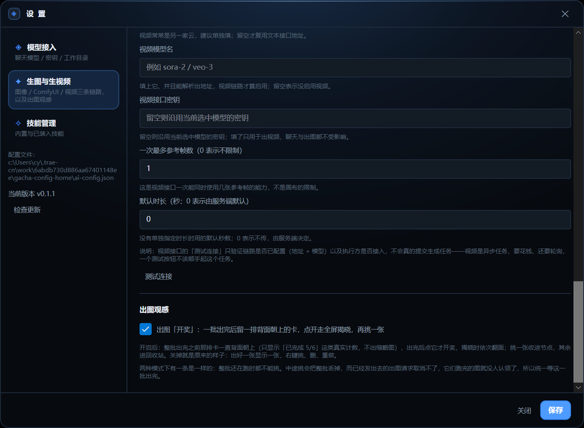
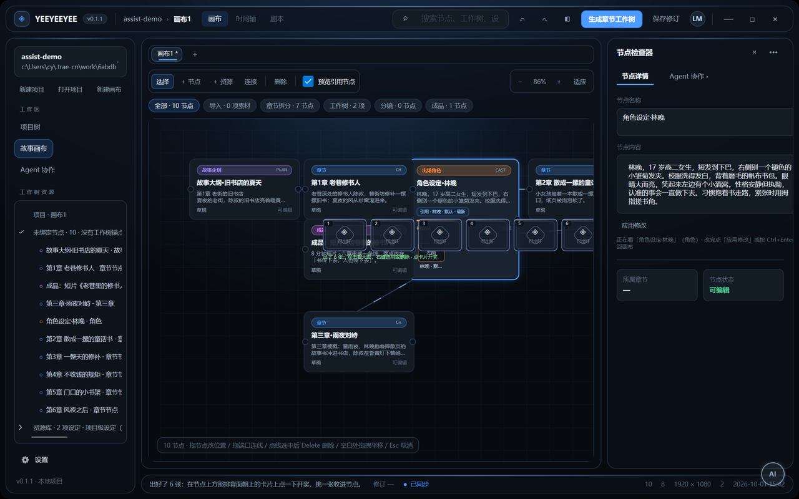
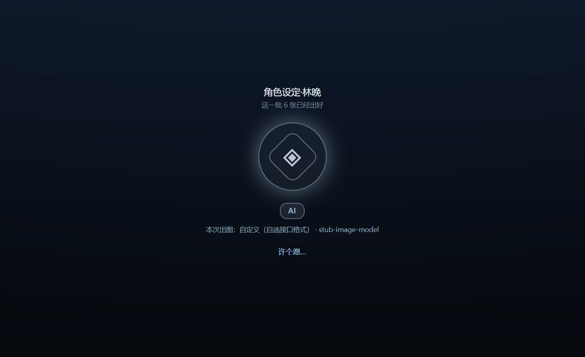
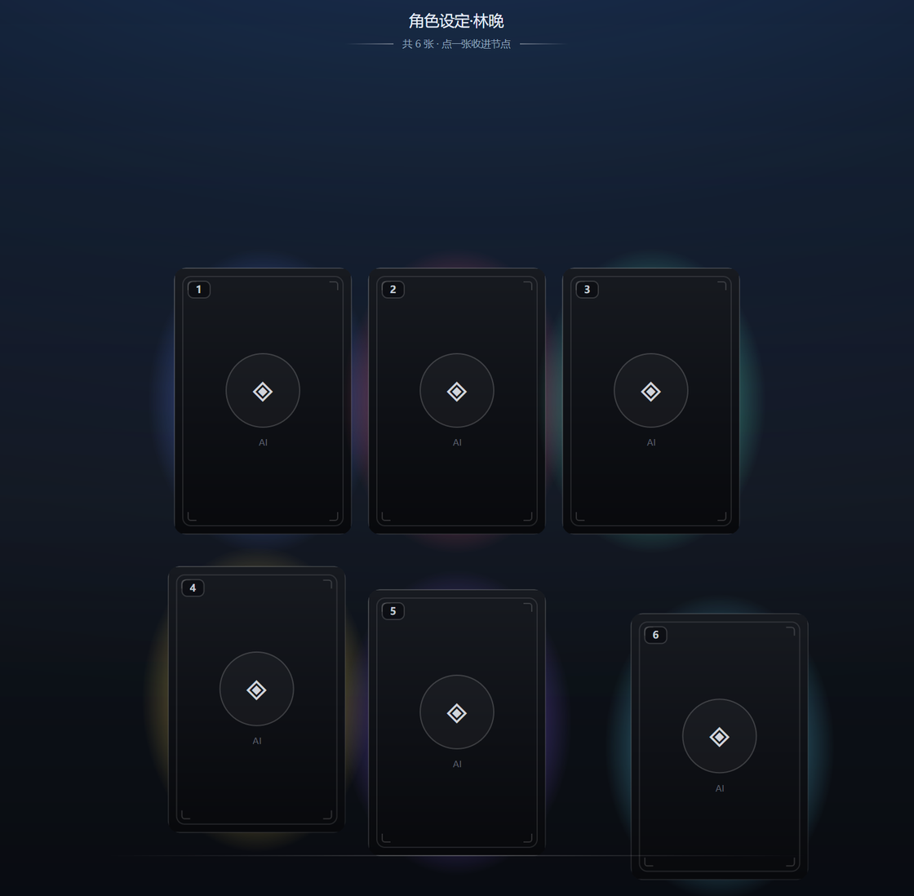
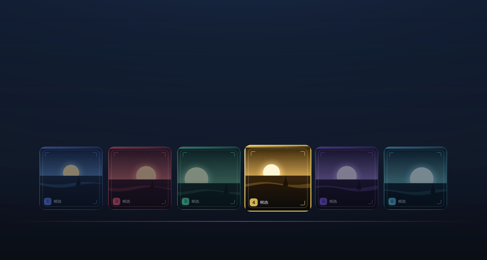
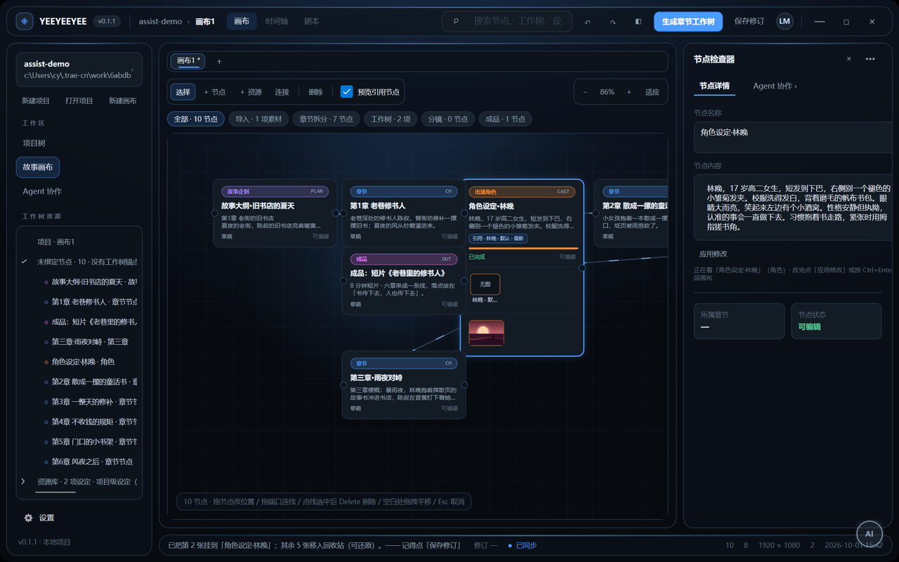
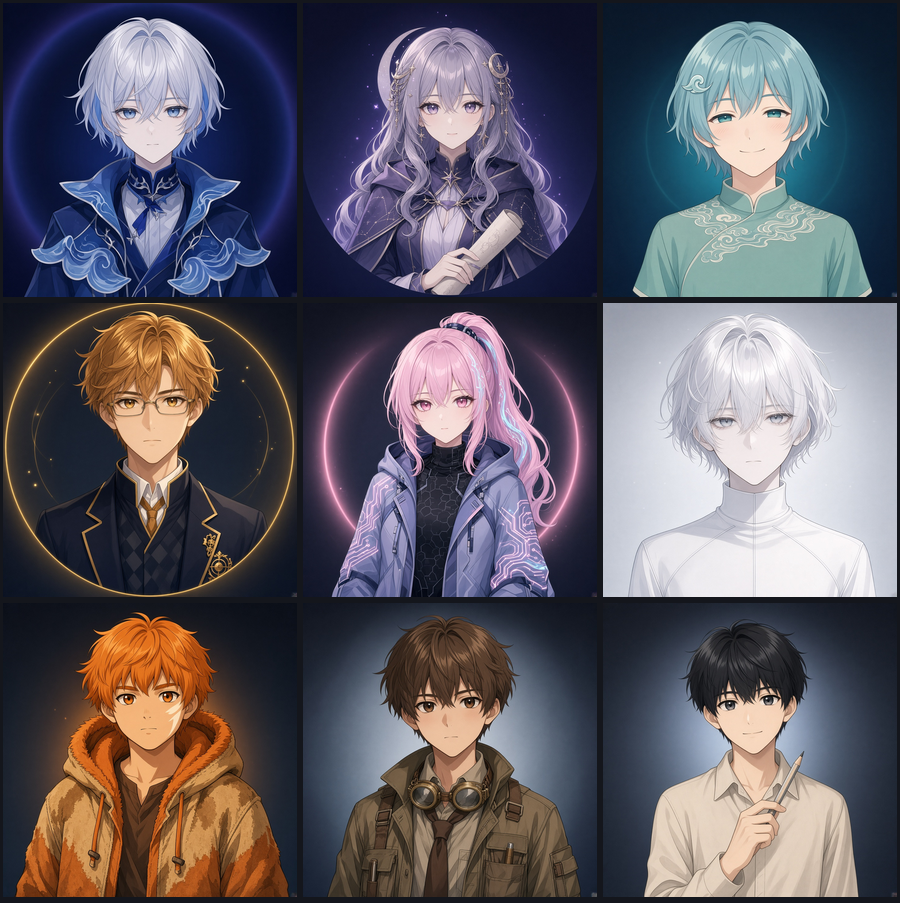
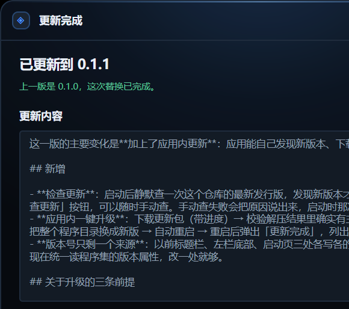

# YEEYEEYEE 使用说明

本文对应 0.1.1 之后的开发版（含「出图开奖」与「判图质量档」两节）。截图取自本机实跑，用的是虚构的演示项目，其中的人物与剧情均为示例；「出图开奖」那几张的图来自本地的桩接口，不是任何真实服务。 

环境要求：Windows 与 .NET 10 SDK。要跑 Web 镜像还需要 Node.js 与 npm。

## 构建与启动

```powershell
dotnet build YEEYEEYEE.slnx
dotnet run --project YEEYEEYEE.Desktop.Avalonia
```

首次启动会停在启动页，等选定项目之后才加载画布、工作树与 Agent 设置。

## 启动页选项目


下半屏是动作区，三个入口互不重叠：在输入框里填名字点 **新建项目**，点 **打开项目…** 指向已有的项目文件夹，或者直接点 **最近项目** 里的一条（列表同时显示每个项目的最后修改时间与所在路径，路径已失效的条目会标红）。

项目就是一个文件夹，里面固定有 `project.json` 与 `canvases`、`assets`、`skills`、`plugins` 四个子目录。项目之间的画布、资产与技能互不相通。

## 工作台


窗口分三层，从上到下看一遍就知道东西在哪。

顶部是标题栏与视图切换：**画布**看空间布局，**时间轴**按章节摊开分镜与状态，**剧本**把带文字的节点按章节排成可读的稿子。三者读的是同一份数据。

左栏从上往下是四段：

- **设置**与当前项目卡片（点卡片可换项目），下面是新建项目 / 打开项目 / 新建画布。
- **工作区**三选一：项目树、故事画布、Agent 协作。
- **工作树资源**是项目树的展开形态，按章节分组，每组列出该章的分镜数量、本章出场的人物，以及没有工作树锚点的自由节点。
- 最底下是版本号。

中间是画布。上方工具条给出选择、加节点、加资源、连线、删除，以及缩放与适应；再下面一排芯片按类别筛选（全部、导入、章节拆分、工作树、分镜、成品）。画布手势：

- 拖动节点改位置
- 从节点端口拖出连线
- 点一下线选中，按 Delete 删除
- 空白处拖拽平移画布，滚轮缩放
- Esc 取消当前操作

右栏是节点检查器。默认显示节点详情，选中画布上的节点后可直接改名称与内容；上方有 **Agent 协作 ›** 按钮，点开就在同一位置换成对话面板。

底部状态栏显示当前画布的修订号、同步状态、节点与连线数量、画幅与最后修改时间。

## 两条主线

项目里有两种完全不同的数据，不要混着理解。

**叙事轴是工作树**：项目 → 章节 → 角色 → 能力。它写的是剧情向的设定，回答「这一章发生什么」。画布上的节点靠 `WorkTreeItemId` 挂到章节点上，所以工作树能反过来定位节点。

**视觉轴是设定库**：实体 → 变体 → 不可变版本。角色、场景、道具都记在这里，回答「长什么样」。分镜不自己复制一份描述，而是通过引用指向某个实体的某个变体；出图时把引用的描述拼进提示词，并把变体上的参考图一起带上。

节点的位置由 `ParentNodeId` 决定，叙事归属由 `WorkTreeItemId` 决定，视觉来源由引用决定。三者各管一件事，混用会让自动排版或引用判断出错。

## 让 Agent 干活


面板上方选授权模式：

- **Ask**（默认）把每批动作先做成虚影放在画布上，你看过再决定
- **AutoStage** 直接落进预览层，仍然要你点保存才写盘
- **ReadOnly** 只回答，不改画布

在输入框里描述要做的事，或在下面直接写第一句。虚影只改预览层，勾选过的动作点保存才会落盘，所以「问一句」和「改数据」是分开的两步。

Agent 的一批动作要么整批生效、要么整批不生效。提交之后如果想退回，用面板上的撤销上次提交；它基于快照回滚，因此要求那之后画布没有别的改动。

把面板收起来后，右下角会留一枚圆形徽标，点一下重新展开。徽标上的字母与颜色跟着当前模型所属的厂家走。
它平时是**半透明**的（浮在画布上，实心时会挡住底下的节点），鼠标移上来才变实，移开再淡回去。

## 接入模型


设置里的第一页管聊天模型。可以同时保存多份配置（例如一份用于长文、一份日常用便宜的），列表里带 **当前** 标记的那一份才是真正发请求用的；点一行即可切换，并会让它进入下面的编辑区。

填地址时先选接口格式，再填基础地址：程序会按格式自动补 `/chat/completions` 或 `/v1/messages`。服务商预设会把地址、接口格式、采样开关与推荐模型一并填好，你只需要补密钥。

密钥按平台加密后落盘（Windows 用当前用户作用域的 DPAPI），配置文件是用户配置目录下的 `ai-config.json`。加密绑定账户与设备，换机器或换系统需要重填一次密钥。界面只显示脱敏后的形式，不会回显完整密钥。

## 生图与生视频


第二页管出图与出视频，和聊天用哪家模型无关——一条链路一家站是常态，所以图像接口有自己独立的地址、模型名与密钥，留空时才沿用当前选中那份的密钥。

**智能导入**是这一页最快的入口：把某家的接口说明网页地址给它，程序会抓取页面、解析出可用的接口与模型，建成技能与站点，再让你填密钥；接着可以跑一次最小测试确认接口真的能用，并查一次余额。抓不到的页面（前端渲染的文档站只返回一个空壳）会明确提示改用粘贴正文，不会假装解析成功。

页面下方还有 ComfyUI 与视频两段。视频这条链路的执行方尚未接入：池子可以登记，但选中后会明确拒绝，不会偷偷起一个花钱的异步任务。

这一页最底下是 **出图观感**，两个勾选框（默认都关，行为与以前完全一致）：

- **出图开奖**：一批图出完之后，画布上不直接摊开缩略图，而是留一排背面朝上的卡让你点开。
- **判图质量档**：一批图出完之后，多花一次模型调用，让视觉模型照着提示词与负面提示词给每张打分，再按分数定档（金 / 红 / 紫 / 蓝 / 白，踩中负面词的另算裂纹卡）。
  它要求当前选的模型**开了「支持图片输入」**；没开的时候这行会直接写明是哪个原因挡住了，不会给你一个点了必然失败的入口。

两个勾选框都只改「出图之后怎么给你看」，不对应任何接口字段，所以存在配置文件的顶层，换模型、换项目都跟着走。



## 技能、站点与池子


「技能」这个词在项目里指三件不同的东西，看这一页时不要混：

- **生成技能**：`skills/*.json` 里的流程定义，运行时会真的调接口出图。
- **内置技能**：随程序发布的提示词清单，用来告诉 Agent 这类要求该按什么套路产出。它们只能停用，不能删。
- **角色能力**：工作树里的剧情设定，不出图。

**站点与池子**是「一家站有哪些能用的」的归口。一个站点一个文件，池子是它下面的选项（模型 × 档位）。调用前会先问一次用哪个池子，选过的池子会被记住并预选；找不到上次那个池子时不会退回第一个，而是重新问你。探测站点有哪些池子的过程全程只读，不会顺手起任务。

## 出图批次

在画布上选中节点，指定用哪个池子、出几张（1 到 6）。点下去之前会给出预估花费。

生成过程中，候选窗口浮在该节点上方，逐格显示进度，不需要你盯着别处。出好之后：

- 选中一张保存到节点上，其余自动移入回收站，不会堆在项目里。
- 已生成的图支持右键删除，删除会同时移走文件并解除引用。

（勾了下面的「出图观感 → 出图开奖」时，出完那一步换成留一排背面朝上的卡，其余规矩不变。）

如果这个节点引用的设定在你出图之后被改过（描述或参考图变了），卡片上会提示建议重出。判断方式是出图时记下当时每条引用的指纹、之后拿现算的值比对，所以它只报真的变过的情况；早于这套机制出的图没有可比对的依据，会如实说明，不会补记当前值来假装当初就是这一版。

出图之前还能跑一次生成链自检，它会沿「设定图 → 分镜图 → 分镜视频 → 成品视频」报出还缺什么、分别要花多少。

## 出图开奖（可选）

在「设置 → 生图与生视频 → 出图观感」里勾上之后，一批图出完不再直接摊开缩略图，而是留一排**背面朝上**的卡盖在节点上方，只露「已出好」和编号：



点其中任意一张，走一段全屏揭晓。整段按二游抽卡的分拍来走，一共五拍——**每一拍的画面都是代码画的，不用任何素材图，
也不抄任何一家的具体演出**：

**① 蓄势（0–0.8 秒）**：屏幕上方自上而下依次是节点名、「这一批 N 张已经出好」、
一个圆形形象（环取厂家配色、带同色光晕，整体缓缓上下呼吸；圆里默认是我们的 ◈ 徽记，
你给这家放了形象图就是那张图，见下面「每个厂家的形象」）、一枚写着厂家两字母缩写的徽标，
以及「本次出图：…」和「许个愿…」；同时有一圈小光点从四周**往中心收**。



**② 爆发（0.8 秒）**：一束竖光从中间撑开，一圈白光炸开，全屏闪一下白（峰值压到 34%——全屏、无边框，
再亮就刺眼了），光点朝上散开，许愿区与尘埃一起淡出。**判过档的批次这一拍的强弱按整批最高档来**
（红最烈、白最弱）；没判档的批次走原来那档强度，光点是固定的 4 个。


**③ 卡片飞出（1.25 秒起）**：一张接一张从中心飞出来落到自己的位置上，互相错开 90 毫秒；落位用 Back 系缓动
（先冲过头一点再收回来），所以有「砸到位」的感觉。这时露出来的还是黑白卡背。



**④ 依次翻面**：从左上开始一张一张翻，每张错开 170 毫秒，翻完闪一下。

**⑤ 全部揭晓**：这时才开始接受挑选。


**排列按张数定**：一行最多三张，超了就换行——**六张就是上面三张、下面三张**（四张走 2×2，五张是上三下二）。
张数少就给大一点：一张 300 宽，两张 260，三张 240，四张及以上 200。

**卡片是固定的竖长方形**（高:宽 = 3:2），不跟着图的比例走——一副牌就是要大小一致；
跟着图走的话一排里方的方、横的横，看着是一排缩略图而不是一手牌。
代价是**方图（出图默认就是方的）会裁掉两侧约三分之一**：六张的裁法完全一样，比的是同一把尺子，
而收进节点的那张是没裁过的原图，所以裁掉的那点构图并没有丢。



全部翻完之后点一张选中：它抬起来、亮起来，身后的光也更亮，其余**连光一起**压暗，好让你一眼看清挑的是哪一张。
然后「用这一张」收进节点；其余照老规矩移入回收站。



**卡片是黑白的**：一层深灰卡纸、一圈灰白描边（左上亮、右下暗的斜向渐变）、内衬细线、四角刻线；
背面中间是我们自己的 ◈ 徽记，下面一行是厂家的两字母缩写（不用任何厂家的 logo——那是各自的商标，
摆上去还会让人以为有官方合作），左上角是序号。

**颜色全在卡片背后那团光里。** 每张卡背后一团缓缓漂动、轻轻呼吸的光晕，颜色取它自己那张图的主色相
（把图缩到 24 宽、按色相分桶取最主要的一桶，再按固定的饱和度画出来）。
六团光的周期与起始方向都不同——同步就白做了：六团一起亮一起灭看起来是一整块背景，反而分不出哪团属于哪张卡。
这么分开是有原因的：卡面一旦上色（早先那一版就是这么干的：彩色描边、彩色色带、彩色角标），
它就和自己要展示的那张图抢眼，看着「花」而不是「好」；把颜色挪到卡背后之后，卡片安静了，
而颜色反而成了更好用的线索——扫一眼光就知道哪张是哪张。

光晕说的主要不是「这张卡更好」——它取的是这张图自己的主色相，好让你扫一眼就知道哪张是哪张；
**档位的高低体现在光晕的亮度上**（金最亮、白略暗），但颜色仍然只表达「偏什么色」。

几处刻意的取舍：

- **揭晓是你点开的，不是自己弹出来的。** 图在打开这一层之前就已经全部出好，所以看多久、挑不挑、要不要「先不开」都由你定；直接关掉不留痕迹，那排卡仍盖在原处，可以再点开。
- **形象是自有的**：◈ 标记加厂家配色，不用任何厂家的 logo 或拟人形象——那些是各自的商标与著作权作品，摆上去还会让人以为有官方合作。
- **爆发那束光的颜色说的仍是结果，不是预告。** 二游常常用光的颜色暗示抽到了什么——也就是说那束光在**预告**结果。
  这里的光是从结果**倒推**出来的：把这批图各自的主色相在圆周上平均成一个，拿它当灯——它描述的是「这批图整体偏什么色」，
  与档位无关，所以它不撒谎、也没法撒谎。**档位另有它自己的两处表达**：卡面右下的档位牌，和按档位增多的光点。
- **光点数量、光晕亮度、预兆强度都按档位分**（判了档才有）：红 12 个光点 / 最亮，依次递减到白 3 个 / 最暗。
  **没判档的批次仍走统一常数（4 个光点）**——「没有档位」与「白档」在界面上是两回事，不合并。
- **档位是模型的判断，不是客观结论。** 抬头副标题、选中卡的页脚、页脚描述三处都写着这句话；
  档位牌写的是 `红 9/10` 这种形式——**分数一起写出来**，因为档位就是分数切出来的带子，分数才是原始信息。
  踩中负面提示词的写「裂纹 5/10」，下面再补一行命中的原词。
- **整批出完才能挑，这一条与开关无关。** 还在跑的时候丢掉整批并不会取消已经发出去的请求，它们跑完后仍会写进资产目录，而那些文件不会有任何地方引用。所以跑着的时候单张的选用、放大、删除都是灰的，菜单里也会写明「这一批还在出，出完再挑」。

## 判图质量档（可选）

在「设置 → 生图与生视频 → 出图观感」里勾上 **判图质量档** 之后，一批图出好后会多花一次模型调用，
让视觉模型**照着你写出去的提示词与负面提示词给每张打一个 0–10 的分**，再按分数定档：
**9 分以上红、7–8 金、5–6 紫、3–4 蓝、2 分以下白**（**红最好、金第二**，与多数二游把金放最上面不同）。
判定期间状态栏写着「正在判定档位（要花一次模型调用）」，判完写「档位已判好（模型）。点那排卡开奖。」

几个要点：

- **判的是绝对分，不是这一批里的名次。** 名次那套的问题是：同一批里就算六张都很差，也一定有一张「红」，
  而那张牌说的是「这批里最好」，不是「真的好」。绝对分有固定标准，所以**一张图自己也能判**，
  两次出图的结果也能拿来互相比较。分数带就写在上面的设置页里，你可以自己核对「8 分为什么是金」。
- **评审要看的四件事**：① 与出图要求的贴合度（主体、服装、场景、构图有没有画错或漏掉）
  ② 崩坏（多余手指 / 手指数量不对、肢体断裂、五官扭曲、糊成一团、错字乱码）
  ③ 穿帮（多出来的人或物、文字水印、边框、拼图痕迹、透视与光影矛盾）
  ④ **角色与物体互相嵌进去**（人陷进地面或家具、身体与道具融合、手插进身体）与不该裁的部位被裁掉。
- **提示词里还带两样东西**：**负面提示词原文**（要求逐张逐条对照，命中就把原词报回来），
  以及**这一步在节点树里的位置**（节点名、类别、章节、这一步引用的设定）——
  只给评审一张立绘，它没法判断「符不符合要求」，因为要求是由这一步在整条链路里的用途决定的。
- **踩中负面提示词的那张是裂纹卡**：卡面压暗一层、叠几道折线裂纹，档位牌换成裂纹色写「裂纹 5/10」，
  下面补一行命中的原词；页脚还会把命中的词逐条列出来。**分数照给**——分数是分数、裂纹是裂纹，
  两件事都留着。裂纹卡**不参与预兆**（它分数再高，也不会让这一批的入场变成最烈的那种）；
  全是裂纹卡时按白档给最弱的预兆，而不是当成「没判过」。
- **本地只筛客观坏图**：读不出来的、纯色的、短边不到要求一半的——这三类是客观事实，命中就直接落白档并写明原因。
  **判不了的如实说「不判」**，不会把一张能正常打开的图说成「好」，也不会假装量过（非 PNG 就直接说明尺寸不检查）。
- **分数必须完整且合法才认**：每一格都要有一个 0–10 的整数分，编号不重不漏；
  漏项、重复、越界、超出范围的分数、坏 JSON 一律作废，并把原因写出来（越界的那个分数也会写出来），
  不会静默按剩下的排。

判完档之后六张卡（上面的例子是本地桩接口出的一批）——抬头多一行模型免责声明，
每张卡右下角一枚档位牌，第 3、5 张是踩中负面词的裂纹卡（卡面裂开、牌上写着命中了哪条）：


## 每个厂家的形象（可选）

开奖许愿那一拍中间是一枚圆形形象。它默认是我们自绘的 ◈ 徽记，你也可以给**每个厂家**放一张自己的图：
把图片放进下面任一个 `provider-art` 目录，文件名用厂家 id（`deepseek` / `moonshot` / `qwen` / `zhipu` /
`siliconflow` / `openai` / `ollama` / `custom`），扩展名 png / jpg / jpeg / webp / gif 都认——
用户配置目录优先（换版本、重新发布都不会把它覆盖掉）：

- `%LOCALAPPDATA%\YEEYEEYEE\provider-art\`
- 程序目录下的 `provider-art\`

放进去之后，那一家的形象会被圆环裁成圆形显示；没放就用回 ◈ 徽记，构图完全一样。

**仓库自带九张**（deepseek / moonshot / qwen / zhipu / siliconflow / openai / ollama / local / custom），
是出图接口生成的**自创角色**——只借各家的气质与配色，不是网上流传的那些拟人形象：
那样的图著作权属于各自的画师与厂商，装进一个公开发布的仓库既涉及著作权，也容易被人读成「和官方有合作」。
每张的提示词、用的模型与生成时间都记在 `provider-art/_generation.json` 里，可追溯、可重生成。



想换一张：在「设置 → 生图与生视频 → 出图观感」里点**「用当前图像链路生成这一家的形象」**，
它会用你自己配置的图像接口画一张（1024×1024）并存进上面的目录，同名的旧图会被替换。
以后接了新厂家，也是点一下就有。

## 数据放在哪

项目数据全在项目文件夹里：

```
project.json
canvases/        画布 JSON（改动前自动备份到 canvases/backups）
assets/          生成的图片与其它资产（删除进 assets 回收站）
skills/          生成技能与站点文件（站点在 skills/sites/）
plugins/         插件目录
```

用户级数据在用户配置目录（Windows 为 `%LOCALAPPDATA%\YEEYEEYEE`）：`ai-config.json` 存加密后的密钥，`recent-projects.json` 存最近项目。这两项都有环境变量可以改到别处。

保存画布只有一条写路径：深拷贝 → 版本迁移 → 完整性校验 → 目标已存在则先备份 → 原子替换。所以不存在某个入口绕过备份。

## 更新

应用启动后会自动查一次这个仓库的最新发行版，发现新版才弹窗；设置页左栏底部也有「检查更新」按钮，随时可以手动查。两者的失败处理不同：手动查失败会把原因说出来，启动时那次失败则不打扰你（想看原因就去设置页点一下）。

弹窗里给三件事：当前版本与最新版本、这一版的发行说明、「下载并升级 / 去发布页 / 稍后再说」。如果这次没法在应用内升级——发行版没附带 zip 包，或者程序目录不可写——弹窗会说明是哪个原因，并且只留「去发布页」。

点「下载并升级」之后：

1. 下载 zip 到临时目录并解压。解压结果里必须真的有主程序，否则拒绝替换（换了等于把程序目录搬空）。
2. 弹出确认，说明接下来会发生什么。
3. 点「立即重启」后应用退出，一个替换脚本把整个程序目录换成新版，再把应用启动回来。
4. 重启后弹出「更新完成」，列出这次换了什么。



替换只对**便携部署**有效：程序目录必须可写，所以不要装在 Program Files 这类受保护位置。替换期间不要手动打开程序。失败时不会静默吞掉——重启后会明确告诉你「更新没有生效」以及失败在哪，并给出脚本日志的路径；脚本自己回滚也失败时，会把旧文件所在的目录一并写出来。

判断更新有没有生效看的是**跑起来的版本号**，不是脚本说它成功了：标记写着更新到 0.2.0 而现在仍然是 0.1.0，就会被判定为没生效。

版本号只有一个来源：程序集属性（项目文件里的 `<Version>`）。标题栏那枚胶囊、左栏底部、设置页显示的都是它，不再各处写死。

### 发布新版本

`tools/publish-release.ps1` 按项目文件里的版本号打出一个便携 zip，默认框架依赖（约 12 MB，需要目标机器有 .NET 10 运行时），加 `-SelfContained` 则把运行时一起打进去。把 zip 上传到对应的 GitHub 发行版即可，应用内升级下载的就是它。

## 当前边界

这些是 0.1.1 明确没做的部分：

- **视频生成**只有枚举与提示词条目，执行方未接入。
- **Web 端**能镜像展示桌面画布、能请求替换引用版本，但不能独立完成创作。
- **协作与账号**（房间、邀请码、配额、审计）未实现。
- **MCP 服务**是独立的只读 stdio 服务，未接入桌面端，也不在解决方案里。
- 桌面端与 Web 目前只有一条耦合：Web 读桌面项目的画布文件。要让 Web 独立，前提是先做完项目级资源库与稳定 ID 迁移。
