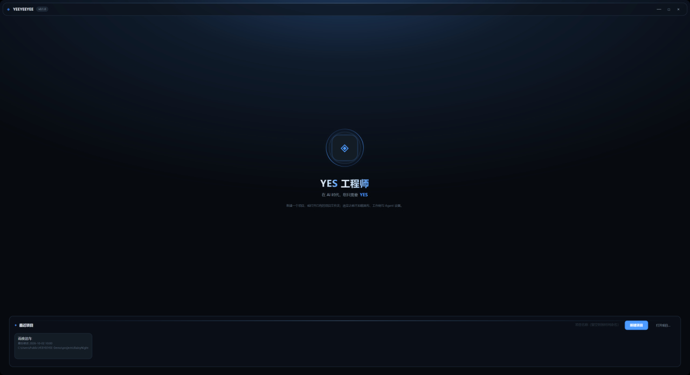
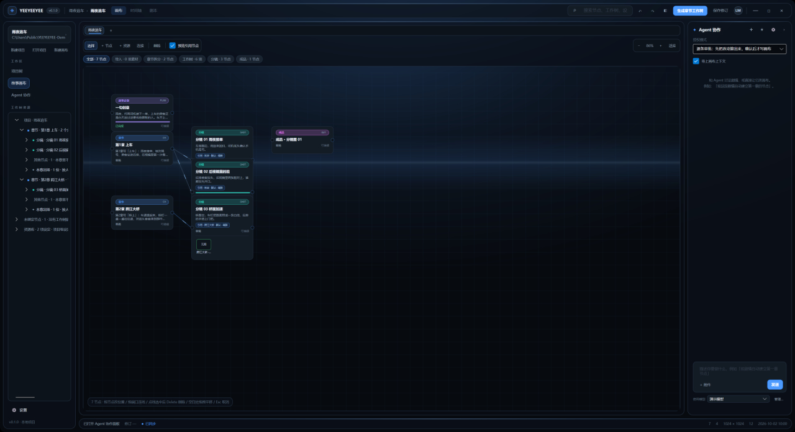
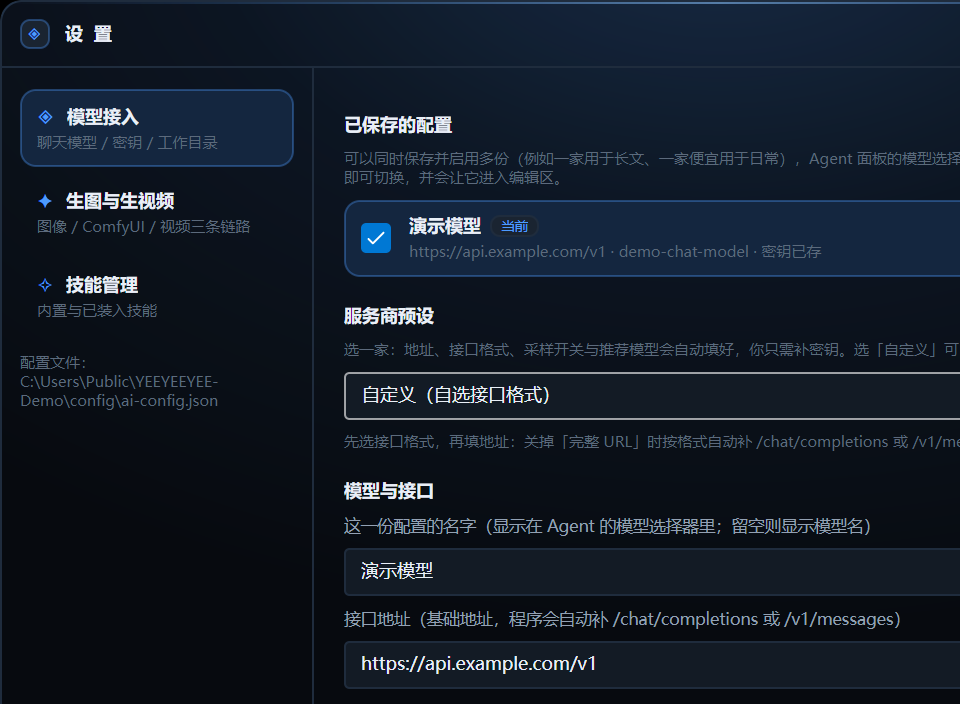
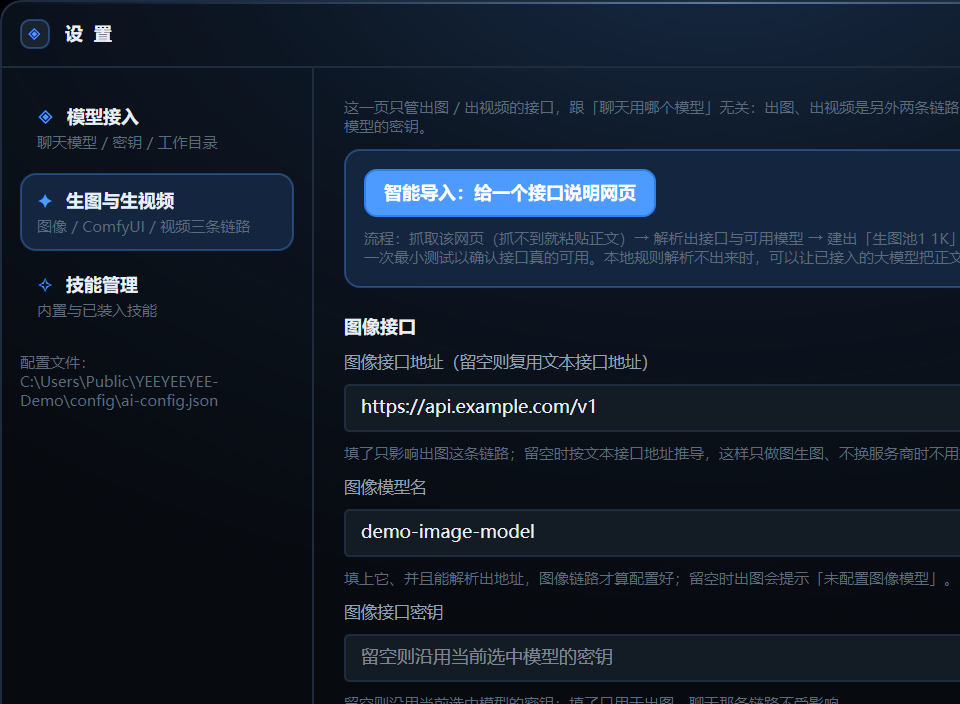
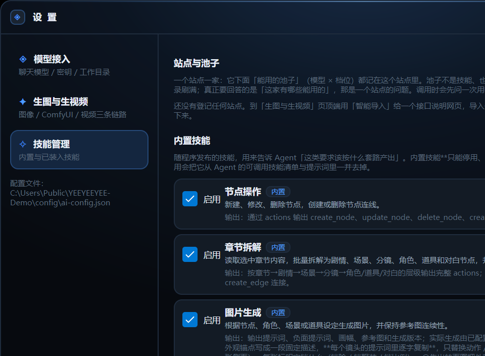

# YEEYEEYEE 使用说明

本文对应 0.1.1。截图取自本机实跑，用的是虚构的演示项目《雨夜追车》，其中的人物与剧情均为示例。

环境要求：Windows 与 .NET 10 SDK。要跑 Web 镜像还需要 Node.js 与 npm。

## 构建与启动

```powershell
dotnet build YEEYEEYEE.slnx
dotnet run --project YEEYEEYEE.Desktop.Avalonia
```

首次启动会停在启动页，等选定项目之后才加载画布、工作树与 Agent 设置。

## 启动页选项目



下半屏是动作区，三个入口互不重叠：在输入框里填名字点 **新建项目**，点 **打开项目…** 指向已有的项目文件夹，或者直接点 **最近项目** 里的一条（列表同时显示每个项目的最后修改时间与所在路径，路径已失效的条目会标红）。

项目就是一个文件夹，里面固定有 `project.json` 与 `canvases`、`assets`、`skills`、`plugins` 四个子目录。项目之间的画布、资产与技能互不相通。

## 工作台


窗口分三层，从上到下看一遍就知道东西在哪。

顶部是标题栏与视图切换：**画布**看空间布局，**时间轴**按章节摊开分镜与状态，**剧本**把带文字的节点按章节排成可读的稿子。三者读的是同一份数据。

左栏从上往下是四段：

- **设置**与当前项目卡片（点卡片可换项目），下面是新建项目 / 打开项目 / 新建画布。
- **工作区**三选一：项目树、故事画布、Agent 协作。
- **工作树资源**是项目树的展开形态，按章节分组，每组列出该章的分镜数量、本章出场的人物，以及没有工作树锚点的自由节点。
- 最底下是版本号。

中间是画布。上方工具条给出选择、加节点、加资源、连线、删除，以及缩放与适应；再下面一排芯片按类别筛选（全部、导入、章节拆分、工作树、分镜、成品）。画布手势：

- 拖动节点改位置
- 从节点端口拖出连线
- 点一下线选中，按 Delete 删除
- 空白处拖拽平移画布，滚轮缩放
- Esc 取消当前操作

右栏是节点检查器。默认显示节点详情，选中画布上的节点后可直接改名称与内容；上方有 **Agent 协作 ›** 按钮，点开就在同一位置换成对话面板。

底部状态栏显示当前画布的修订号、同步状态、节点与连线数量、画幅与最后修改时间。

## 两条主线

项目里有两种完全不同的数据，不要混着理解。

**叙事轴是工作树**：项目 → 章节 → 角色 → 能力。它写的是剧情向的设定，回答「这一章发生什么」。画布上的节点靠 `WorkTreeItemId` 挂到章节点上，所以工作树能反过来定位节点。

**视觉轴是设定库**：实体 → 变体 → 不可变版本。角色、场景、道具都记在这里，回答「长什么样」。分镜不自己复制一份描述，而是通过引用指向某个实体的某个变体；出图时把引用的描述拼进提示词，并把变体上的参考图一起带上。

节点的位置由 `ParentNodeId` 决定，叙事归属由 `WorkTreeItemId` 决定，视觉来源由引用决定。三者各管一件事，混用会让自动排版或引用判断出错。

## 让 Agent 干活



面板上方选授权模式：

- **Ask**（默认）把每批动作先做成虚影放在画布上，你看过再决定
- **AutoStage** 直接落进预览层，仍然要你点保存才写盘
- **ReadOnly** 只回答，不改画布

在输入框里描述要做的事，或在下面直接写第一句。虚影只改预览层，勾选过的动作点保存才会落盘，所以「问一句」和「改数据」是分开的两步。

Agent 的一批动作要么整批生效、要么整批不生效。提交之后如果想退回，用面板上的撤销上次提交；它基于快照回滚，因此要求那之后画布没有别的改动。

把面板收起来后，右下角会留一枚圆形徽标，点一下重新展开。徽标上的字母与颜色跟着当前模型所属的厂家走。

## 接入模型



设置里的第一页管聊天模型。可以同时保存多份配置（例如一份用于长文、一份日常用便宜的），列表里带 **当前** 标记的那一份才是真正发请求用的；点一行即可切换，并会让它进入下面的编辑区。

填地址时先选接口格式，再填基础地址：程序会按格式自动补 `/chat/completions` 或 `/v1/messages`。服务商预设会把地址、接口格式、采样开关与推荐模型一并填好，你只需要补密钥。

密钥按平台加密后落盘（Windows 用当前用户作用域的 DPAPI），配置文件是用户配置目录下的 `ai-config.json`。加密绑定账户与设备，换机器或换系统需要重填一次密钥。界面只显示脱敏后的形式，不会回显完整密钥。

## 生图与生视频



第二页管出图与出视频，和聊天用哪家模型无关——一条链路一家站是常态，所以图像接口有自己独立的地址、模型名与密钥，留空时才沿用当前选中那份的密钥。

**智能导入**是这一页最快的入口：把某家的接口说明网页地址给它，程序会抓取页面、解析出可用的接口与模型，建成技能与站点，再让你填密钥；接着可以跑一次最小测试确认接口真的能用，并查一次余额。抓不到的页面（前端渲染的文档站只返回一个空壳）会明确提示改用粘贴正文，不会假装解析成功。

页面下方还有 ComfyUI 与视频两段。视频这条链路的执行方尚未接入：池子可以登记，但选中后会明确拒绝，不会偷偷起一个花钱的异步任务。

## 技能、站点与池子



「技能」这个词在项目里指三件不同的东西，看这一页时不要混：

- **生成技能**：`skills/*.json` 里的流程定义，运行时会真的调接口出图。
- **内置技能**：随程序发布的提示词清单，用来告诉 Agent 这类要求该按什么套路产出。它们只能停用，不能删。
- **角色能力**：工作树里的剧情设定，不出图。

**站点与池子**是「一家站有哪些能用的」的归口。一个站点一个文件，池子是它下面的选项（模型 × 档位）。调用前会先问一次用哪个池子，选过的池子会被记住并预选；找不到上次那个池子时不会退回第一个，而是重新问你。探测站点有哪些池子的过程全程只读，不会顺手起任务。

## 出图批次

在画布上选中节点，指定用哪个池子、出几张（1 到 6）。点下去之前会给出预估花费。

生成过程中，候选窗口浮在该节点上方，逐格显示进度，不需要你盯着别处。出好之后：

- 选中一张保存到节点上，其余自动移入回收站，不会堆在项目里。
- 已生成的图支持右键删除，删除会同时移走文件并解除引用。

如果这个节点引用的设定在你出图之后被改过（描述或参考图变了），卡片上会提示建议重出。判断方式是出图时记下当时每条引用的指纹、之后拿现算的值比对，所以它只报真的变过的情况；早于这套机制出的图没有可比对的依据，会如实说明，不会补记当前值来假装当初就是这一版。

出图之前还能跑一次生成链自检，它会沿「设定图 → 分镜图 → 分镜视频 → 成品视频」报出还缺什么、分别要花多少。

## 数据放在哪

项目数据全在项目文件夹里：

```
project.json
canvases/        画布 JSON（改动前自动备份到 canvases/backups）
assets/          生成的图片与其它资产（删除进 assets 回收站）
skills/          生成技能与站点文件（站点在 skills/sites/）
plugins/         插件目录
```

用户级数据在用户配置目录（Windows 为 `%LOCALAPPDATA%\YEEYEEYEE`）：`ai-config.json` 存加密后的密钥，`recent-projects.json` 存最近项目。这两项都有环境变量可以改到别处。

保存画布只有一条写路径：深拷贝 → 版本迁移 → 完整性校验 → 目标已存在则先备份 → 原子替换。所以不存在某个入口绕过备份。

## 更新

应用启动后会自动查一次这个仓库的最新发行版，发现新版才弹窗；设置页左栏底部也有「检查更新」按钮，随时可以手动查。两者的失败处理不同：手动查失败会把原因说出来，启动时那次失败则不打扰你（想看原因就去设置页点一下）。

弹窗里给三件事：当前版本与最新版本、这一版的发行说明、「下载并升级 / 去发布页 / 稍后再说」。如果这次没法在应用内升级——发行版没附带 zip 包，或者程序目录不可写——弹窗会说明是哪个原因，并且只留「去发布页」。

点「下载并升级」之后：

1. 下载 zip 到临时目录并解压。解压结果里必须真的有主程序，否则拒绝替换（换了等于把程序目录搬空）。
2. 弹出确认，说明接下来会发生什么。
3. 点「立即重启」后应用退出，一个替换脚本把整个程序目录换成新版，再把应用启动回来。
4. 重启后弹出「更新完成」，列出这次换了什么。

替换只对**便携部署**有效：程序目录必须可写，所以不要装在 Program Files 这类受保护位置。替换期间不要手动打开程序。失败时不会静默吞掉——重启后会明确告诉你「更新没有生效」以及失败在哪，并给出脚本日志的路径；脚本自己回滚也失败时，会把旧文件所在的目录一并写出来。

判断更新有没有生效看的是**跑起来的版本号**，不是脚本说它成功了：标记写着更新到 0.2.0 而现在仍然是 0.1.0，就会被判定为没生效。

版本号只有一个来源：程序集属性（项目文件里的 `<Version>`）。标题栏那枚胶囊、左栏底部、设置页显示的都是它，不再各处写死。

### 发布新版本

`tools/publish-release.ps1` 按项目文件里的版本号打出一个便携 zip，默认框架依赖（约 12 MB，需要目标机器有 .NET 10 运行时），加 `-SelfContained` 则把运行时一起打进去。把 zip 上传到对应的 GitHub 发行版即可，应用内升级下载的就是它。

## 当前边界

这些是 0.1.1 明确没做的部分：

- **视频生成**只有枚举与提示词条目，执行方未接入。
- **Web 端**能镜像展示桌面画布、能请求替换引用版本，但不能独立完成创作。
- **协作与账号**（房间、邀请码、配额、审计）未实现。
- **MCP 服务**是独立的只读 stdio 服务，未接入桌面端，也不在解决方案里。
- 桌面端与 Web 目前只有一条耦合：Web 读桌面项目的画布文件。要让 Web 独立，前提是先做完项目级资源库与稳定 ID 迁移。
